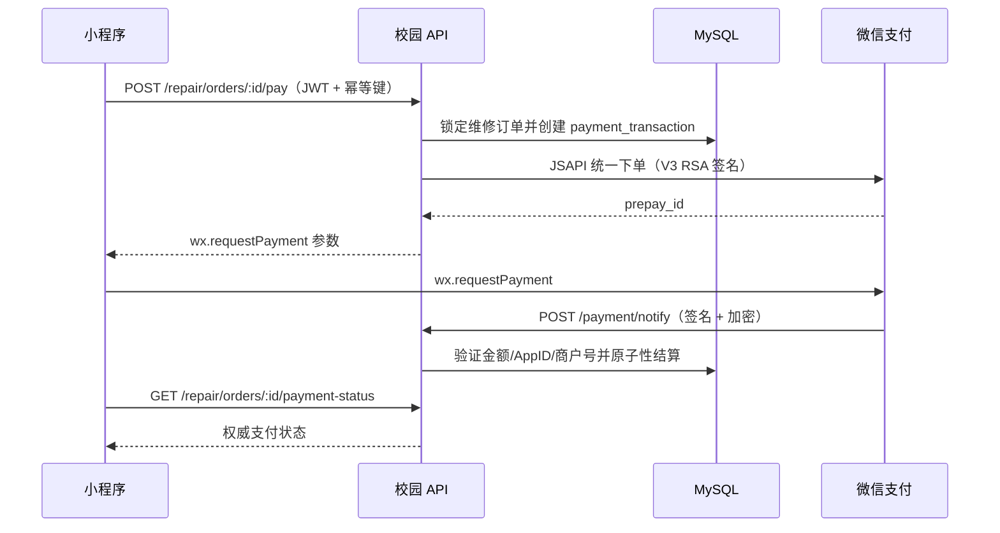

# 业务功能 · 服务与交易

> **合并文档** · 整理日期 2026-10-07
> 合并自 7 篇：`校园服务与评价模块.md`、`校园评价评论_对齐帖子评论_对照梳理.md`、`订单跑腿与支付钱包.md`、`修复说明_2026-09-21_跑腿订单交接阶段权限与隐私.md`、`教务系统对接与OCR识别.md`、`修复说明_2026-09-21_骑手教务认证数据库操作失败.md`、`微信群播报系统.md`
>
> 校园服务六项与评价模块、找驾校、维修服务、订单跑腿与支付钱包、教务系统对接与 OCR、微信群播报系统。
>
> 整理原则：同一主题在多篇中重复出现时只保留最完整/最新的表述；多篇结论冲突时以日期最新的为准并在正文标注；相对时间已改写为绝对日期；原文技术细节（文件路径、代码、参数、测试名、错误码）逐字保留。

## 目录

- **1. 校园服务与评价模块（合并文档）**
  - 概述
  - 原始文档清单
  - 一、校园服务六项总览与展示规范
  - 二、校园评价模块
  - 三、找驾校模块与首页宫格
  - 四、维修服务（广轻维修）上线配置
  - 五、功能访问控制
  - 遗留问题与后续建议
- **2. 校园评价评论 · 对齐帖子评论 · 对照梳理**
  - 〇、结论速览
  - 一、数据模型对照
  - 二、接口结构对照
  - 三、交互流程对照（端上）
  - 四、业务规则对照
  - 五、需要差异化（**不应强行对齐**）的部分
  - 六、待实现要点清单（按优先级）
  - 七、一句话总结
- **3. 订单跑腿与支付钱包**
  - 概述
  - 原始文档清单
  - 跑腿订单状态机与状态角标
  - 订单时间字段口径
  - 订单标签未读红点
  - 微信支付 V3 接入
  - 钱包余额与收益入账规则
  - 提现流程与运营账户余额不足的处理
  - 管理员审核与转账回调
  - 遗留问题与后续建议
- **4. 修复说明：跑腿「待确认」订单对第三方可见、且第三人能点「确认完成」**
  - 一、根因（两层，缺一不可）
  - 二、修复
  - 三、回归护栏
  - 四、验证
  - 五、遗留与后续
  - 六、追加修正：大厅不得出现当事人自己的「已取消/已完成」历史订单（同日第二次修）
- **5. 教务系统对接与 OCR 课程表识别**
  - 概述
  - 原始文档清单
  - 一、整体链路与模块职责
  - 二、验证码登录与跳转问题
  - 三、连接失败与超时处理（学校 SLB 间歇 504）
  - 四、OCR 识别能力评估（教务验证码）
  - 五、OCR 功能恢复与优化
  - 六、课表同步数据口径与常见失败原因
  - 七、配置项与时间线冲突说明
  - 八、复现与回归素材
  - 九、课表展示空态与登录态失效（2026-09-18 修复）
  - 十、遗留问题与后续建议
- **6. 修复说明：骑手教务系统认证报「数据库操作失败」**
  - 一、根因
  - 二、排查过程（可复用的定位手法）
  - 三、修复
  - 四、回归护栏
  - 五、验证
  - 六、遗留与后续
  - 七、同一入口的后续调整：输入框文案与输入类型（2026-09-21 追加）
- **7. 微信群播报系统**
  - 一、系统构成
  - 二、文案格式
  - 三、数据与接口
  - 四、配置（server/.env，完整说明见 .env.example）
  - 五、机器人交付（broadcast-bot/）
  - 六、运维注意

---

## 1、校园服务与评价模块（合并文档）

> 来源文档：`校园服务与评价模块.md`（294 行）

### 概述

校园服务模块面向广轻学生，整合「校园服务六项 / 校园评价 / 找驾校 / 维修（广轻维修）/ 功能访问控制」五项能力。其中校车时刻、轻友指南、校园卡、速印、返乡大巴、特惠寄件等六项服务共用一套「作用 → 场景 → 关键信息 → 流程 → 提示 → FAQ → 咨询」的同源展示模板，统一落在通用详情页 `pages/campus-service/index`，数据来自 `utils/campus-services.js`。找驾校与广轻维修为独立业务页；校园活动、广轻群聊、社团&组织、校园评价四项启用统一的登录 + 认证守卫。

### 原始文档清单

| 原文件名                                                     | 日期       | 一句话要点                                                   |
| ------------------------------------------------------------ | ---------- | ------------------------------------------------------------ |
| 功能说明_2026-09-12_校园服务六项实现与展示规范.md             | 2026-09-12 | 校车时刻等六项补齐真实落地页，统一展示模板与数据降级机制     |
| 功能说明_2026-09-12_校园评价模块.md                           | 2026-09-12 | 课程 / 食堂 / 商圈评分整链路：页面 + 接口 + 数据表 + 两级校区模型 |
| 功能说明_2026-09-12_找驾校模块与首页宫格恢复.md               | 2026-09-12 | 恢复首页 12 列宫格，找驾校列表 / 详情 / 学车指南三页         |
| 功能说明_2026-09-12_功能访问控制.md                           | 2026-09-12 | 四项功能统一「登录 + 教务 / 骑手认证」守卫，入口与页面双层拦截 |
| repair-service-setup.md                                       | 未标注日期 | 广轻维修支付 v3 环境变量、接单订阅模板与登录订阅要求（补充文档，无冲突） |

---

### 一、校园服务六项总览与展示规范

#### 功能描述

六项服务原本在首页宫格无落地页、点击仅弹「服务暂未开放」，属于「运营内容不完整」审核风险点；本次补齐真实落地页。六项展示结构完全同构（作用 → 场景 → 关键信息 → 流程 → 提示 → FAQ → 咨询），差异仅在内容，因此不建 6 个页面，而是用「唯一数据源 + 通用详情页」实现：

```
utils/campus-services.js        6 个服务的内容与配置（唯一数据源）
pages/campus-service/index.*    通用详情页，按 ?id= 渲染
首页宫格 / 全部服务页            入口统一跳 pages/campus-service/index?id=xxx
```

名字 → id 映射由数据源生成（`CAMPUS_SERVICE_IDS`），不在页面里手写，避免改名后两处不同步。「关键信息」需运营填写真实数据（时刻表 / 点位 / 价格 / 电话），当前留空；页面为空时自动降级为「说明 + 咨询入口」，不出现空白区块。

#### 页面与接口

通用详情页 `pages/campus-service/index` 通过首页宫格与全部服务页的 `?id=` 接线渲染，无独立后端接口，内容全部取自定义模块。

六项服务清单、入口与数据来源如下：

| 服务     | id          | 入口（首页宫格位置，12×2 布局） | 页面路径                                      | 数据来源               |
| -------- | ----------- | ------------------------------- | --------------------------------------------- | ---------------------- |
| 校车时刻 | school-bus  | 第一行第 9 列                   | pages/campus-service/index?id=school-bus      | utils/campus-services.js |
| 轻友指南 | campus-guide | 第一行第 11 列                  | pages/campus-service/index?id=campus-guide    | utils/campus-services.js |
| 校园卡   | campus-card  | 第二行第 8 列                   | pages/campus-service/index?id=campus-card     | utils/campus-services.js |
| 速印     | print        | 第二行第 9 列                   | pages/campus-service/index?id=print           | utils/campus-services.js |
| 返乡大巴 | home-bus     | 第二行第 11 列                  | pages/campus-service/index?id=home-bus        | utils/campus-services.js |
| 特惠寄件 | express      | 第二行第 12 列                  | pages/campus-service/index?id=express         | utils/campus-services.js |

#### 数据字段

`utils/campus-services.js` 每项服务的字段：

| 字段            | 说明                                                         |
| --------------- | ------------------------------------------------------------ |
| `tagline`       | 一句话定位                                                   |
| `summary`       | 这个服务能做什么（段落文本）                                 |
| `scenes`        | 使用场景（≥3 条）                                            |
| `steps`         | 怎么用（流程，≥3 步，圆形序号）                              |
| `tips`          | 温馨提示（≥3 条，橙色感叹号圆点）                            |
| `faqs`          | 常见问题（问答非空，≥3 条，可折叠，默认收起）                |
| `info.items`    | 关键信息卡：每条 `标题 + 行式字段（标签 — 值）`；空时降级    |
| `info.note`     | 信息时效标注，建议写「更新于 X 月 X 日」                     |

首页宫格路由由 `CAMPUS_SERVICE_IDS` 生成，按名字取 id 后拼 `?id=`。

#### 配置与依赖

| 配置项                                   | 说明                                                         |
| ---------------------------------------- | ------------------------------------------------------------ |
| `utils/campus-services.js`               | 六项内容与配置唯一数据源；填 `info.items` 即自动从「降级态」切「信息展示态」，无需改页面 |
| `npm test`（server/package.json）        | 守卫用例 `server/tests/campus-service-module.test.js`（25 项）已加入回归 |
| `home-entry-availability.test.js`        | 首页宫格 24 入口全部有落地页，`PENDING_ENTRIES` 白名单已清空 |

#### 注意事项

- 六项页面区块顺序固定（头部 → 能做什么 → 使用场景 → 关键信息 → 怎么用 → 温馨提示 → 常见问题 → 相关入口 → 底部咨询），保证观感一致。
- 关键信息为空时统一降级为「说明文案 + 主色按钮『向管理员索取最新信息』」，底部咨询接 `contact-admin` + 免责说明。
- 价格 / 优惠类信息须注明「以门店 / 驿站公示为准」，运营勿写绝对化承诺（如「全校最低价」）。
- 必须由运营补齐的数据：校车时刻（线路 / 发车时间 / 上车点 / 途经站）、轻友指南（地点位置 / 营业时间 / 电话）、校园卡（卡务中心位置 / 电话 / 办公时间 / 充值渠道）、速印（打印点位置 / 单价 / 支付方式 / 营业时间）、返乡大巴（线路 / 发车时间 / 集合点 / 票价 / 登记截止）、特惠寄件（合作快递 / 寄件点 / 优惠 / 是否上门）。
- 返乡大巴必须提示「人数不足会取消，以最终发车通知为准」，避免学生误以为登记 = 发车。

---

### 二、校园评价模块

#### 功能描述

首页功能栏「校园评价」由「即将上线」占位升级为完整模块：课程评分 / 食堂评分 / 商圈评分，前端页面 + 服务端接口 + 数据表整条链路。课程评价不区分校区；食堂 / 商圈评价按两级校区模型区分。

#### 页面与接口

页面（`pages/review/`）：

| 页面             | 说明                                                         |
| ---------------- | ------------------------------------------------------------ |
| `pages/review/index`    | 评价分类：校区选择 chips + 课程评分 / 食堂评分 / 商圈评分三张卡 |
| `pages/review/list`     | 通用列表页（course / root / child 三种模式）                 |
| `pages/review/target`   | 评分对象详情：均分 / 我的评分五星（可重复评）/ 评价列表 / 底部输入栏 |
| `pages/review/publish`  | 发布评分对象：头像 + 名称（20 字上限）+ 所属分类 chips        |

服务端：`server/controllers/reviewController.js` + `server/routes/reviewRoutes.js`，`app.js` 注册 `/api/v1/review`：

| 接口                              | 方法 | 说明                                                         |
| --------------------------------- | ---- | ------------------------------------------------------------ |
| `/review/targets`                 | GET  | 列表：category / campus / floor / grade / level / parentId / keyword / sort / 分页 |
| `/review/target/:id`              | GET  | 详情（登录附带 myRating / liked）                            |
| `/review/target`                  | POST | 发布对象：课程 levels 按年级推导、强制无校区；子级继承父校区；同名查重 |
| `/review/random`                  | GET  | 随机抽取（按分类 + 校区）                                    |
| `/review/target/:id/rate`         | POST | 评分 1-5，`ON DUPLICATE KEY UPDATE`（可重新评分），聚合以明细表重算 |
| `/review/target/:id/like`         | POST | 对象点赞 / 取消                                              |
| `/review/target/:id/comments`     | GET  | 评价列表（time / likes 排序，登录附带点赞状态）              |
| `/review/target/:id/comments`     | POST | 发布评价（≤1000 字），comment_count 与 hot_comment 联动刷新  |
| `/review/comment/:id/like`        | POST | 评价点赞 / 取消                                              |

#### 数据字段

- `review_target`（19 列）：category / parent_id / name / avatar / campus / floor / grade / levels / hot_comment / rating_sum / rating_count / comment_count / like_count / created_by / status / deleted …
- `review_rating`：target_id + user_id 唯一（一人一分，可覆盖）
- `review_comment`：评价正文、like_count、软删
- `review_target_like` / `review_comment_like`：点赞明细（计数器双写，删明细需重算）
- 前端 `utils/review.js`：`COURSE_LEVEL_TABS`（专科 / 本科 / 专升本 次导航）、`levelsForGrade('通识课')`（三类全适用）；服务端 `reviewController` 同一份镜像校验。
- 校区模型（2026-09-12 二次改造）：一级 广州校区 / 佛山校区，点击展开 新港 / 琶洲、南海南 / 南海北；`campus-picker` 组件新增 `twoLevel` 模式，旧页面不受影响；主校区过滤命中自身 + 全部分校区，分校区精确命中；旧扁平存储值（南海南 / 南海北）读取时自动迁移。

#### 配置与依赖

- 部署：`python deploy_full.py` 或单传 `controllers/reviewController.js`、`routes/reviewRoutes.js`、`app.js`、`utils/migrations.js`；小程序端传 `pages/review/`、`utils/review.js`、`utils/api.js`、`app.json`、`pages/index/index.js`、`components/campus-picker/`。
- 迁移：`server/utils/migrations.js` + `server/sql/init.sql`，启动随 `runMigrations()` 自动建表；可用 `SHOW COLUMNS FROM review_target` 核对。
- 测试：`server/tests/review-module.test.js`（33 项），全量 30 个测试文件通过。
- 顺序：**先部署后端再发前端**，否则前端请求线上会 404；回滚还原上述文件即可，五张新表独立无侵入可保留。

#### 注意事项

- 🐾 计数按「对象点赞」实现（图标语义不明确，取最常见交互）。
- 食堂 / 商圈根级（门店 / 商场）不设楼层，子级（窗口 / 店铺）必选楼层；楼层固定 1层 / 2层 / 3层。
- 「学历层次」在课程评分页顶部切换（专科 / 本科 / 专升本），选择本地持久化；后续若用户资料增加学历字段可自动带入。
- 校区选择交互（2026-09-12 改造）：评价分类页用「校区 xxx ▾」胶囊 + 二级面板；`twoLevel` 为可选模式，社团 / 群聊 / 活动等旧用法仍一级直选，未受影响。

---

### 三、找驾校模块与首页宫格

#### 功能描述

恢复首页「找驾校」入口的位置与图标，宫格回到完整 12 列布局；并仿参考图完善「找驾校」内列表 / 详情 / 学车指南三页，保证「列表 → 详情 → 咨询」流程顺畅。

#### 页面与接口

首页宫格 `pages/index/index.js` 的 `buildHomeGrid` 已恢复为 **12 列 × 2 行 = 24 个入口**：

| 行     | 入口（12 项）                                                                                     |
| ------ | ------------------------------------------------------------------------------------------------ |
| 第一行 | 课程表 · 教务系统 · 成绩查询 · 考试安排 · 校历 · 校园地图 · 自助购电 · 订水系统 · 校车时刻 · 乘车码 · 轻友指南 · 教务文档 |
| 第二行 | 校园活动 · 广轻群聊 · 社团&组织 · 校园评价 · 找驾校 · 校园市场 · 广轻义修 · 校园卡 · 速印 · 失物招领 · 返乡大巴 · 特惠寄件 |

「找驾校」位于第二行第 5 列（与第一行「校历」同列），图标 `assets/icons/svc-driving.png`。

找驾校三页（`pages/driving-school/`）：

| 页面            | 说明                                                         |
| --------------- | ------------------------------------------------------------ |
| `index.*`       | 驾校列表页：区域 + 搜索 + 排序 / 筛选 + 运营横幅 + 驾校卡片   |
| `detail.*`      | 驾校详情页：实景 + 信息卡 + 报名流程 + 场地展示 + 简介 + 服务保障 + 立即咨询 |
| `guide.*`       | 学车指南：学车流程 / 报名材料 / 班型 / 科目学时 / FAQ / 避坑提示 |

列表页交互：区域选择器（全部区域 / 海珠区 / 天河区 / 番禺区 / 南海区）+ 关键词搜索；排序（综合 / 离校最近 / 通过率最高 / 推荐等级）；筛选（服务保障标签多选，AND 语义）。详情页报名流程 5 步：选驾校 → 预报名 → 签合同 → 缴学费 → 体检 / 面签。底部「立即咨询」复用 `contact-admin` 组件（弹出管理员微信二维码），左侧加「学车指南」次级按钮。场地展示无图片时整块不渲染。

#### 数据字段

`utils/driving-school.js` 统一提供：区域选项、服务标签、排序方式、报名流程、示例驾校数据，及 `filterSchools / sortSchools / getSchoolById / buildSchoolCard` 四个纯函数。`SCHOOLS` 为示例数据（字段：名称 / 区域 / 距离 / 通过率 / 推荐等级 / 服务标签 / 场地照片 / 联系方式），上线前须替换为真实合作驾校信息。

#### 配置与依赖

- 首页宫格路由：`onServiceTap` 末尾兜底提示「服务暂未开放」；护栏 `server/tests/home-entry-availability.test.js` 已同步为 12 + 12 双向校验，新增 `PENDING_ENTRIES` 白名单。
- 测试：`server/tests/driving-school-module.test.js`（28 项），全量 47 个测试文件通过。
- WXML 限制：禁止 `(表达式).属性` 与 `{{}}` 内方法调用，否则小程序编译失败。

#### 注意事项

- 示例数据待替换：未替换前不建议对外宣传「已合作驾校」。
- 审核风险：首页宫格恢复 12 列后，校车时刻 / 轻友指南 / 校园卡 / 速印 / 返乡大巴 / 特惠寄件 6 个入口点击仍是「服务暂未开放」，与 2026-09-12 之前提审被驳回的「运营内容不完整」属同一类问题。建议二选一：① 尽快为 6 服务补落地页（在 `onServiceTap` 补跳转）；② 或提审前从 `buildHomeGrid` 的 row1 / row2 去掉这 6 个名字并清空 `PENDING_ENTRIES`（同步用例）。
- 小程序端改动需在开发者工具「上传」后重新提审。

---

### 四、维修服务（广轻维修）上线配置

#### 功能描述

广轻维修页的维修人员、订单和支付金额均以服务端数据为准。服务端接口不可用时页面不再使用本地人员或订单演示数据，避免用户看到无法真实预约的内容。完成 API、数据库和支付回调部署后，再配置服务端环境变量。

维修页提供莫旭卿、冯广兴、蒋文鑫、张彬浩、欧阳文展五位维修人员。维修人员必须以登记手机号登录小程序，系统才会把预约和私信会话关联到其账号；登录后客户可直接进入聊天页，支付确认后也会收到一条预约私信和订阅消息。

#### 页面与接口

| 接口 / 页面                         | 说明                                                         |
| ---------------------------------- | ------------------------------------------------------------ |
| `pages/repair/index`               | 维修页（默认打开页，亦为接单消息落地页）                     |
| `/api/v1/repair/payment/notify`    | 微信支付 v3 回调地址（由 `WX_PAY_NOTIFY_URL` 固定指向）      |
| `GET /api/v1/admin/repair-orders`  | 管理端「日志 → 维修信息」：全部预约记录 + 提交人资料，`requireAdmin('admin.manage')` |
| `server/services/wechatService.js` | 接单订阅消息 `data` 字段映射，模板字段编号不符时需同步修改   |

支付回调成功后，服务端校验签名、AppID、商户号和金额，再将订单更新为「待接单」。

#### 数据字段

维修接单订阅消息模板字段约定：

| 模板字段       | 含义           |
| -------------- | -------------- |
| `thing1`       | 设备 / 故障     |
| `thing2`       | 地址           |
| `time3`        | 预约时间       |
| `name4`        | 联系人         |
| `phone_number5` | 手机号         |

> 若微信后台选用的模板字段编号不同，需同步修改 `server/services/wechatService.js` 中的 `data` 映射。

#### 配置与依赖

支付环境变量与支付流程合并成一张表（均为服务端环境变量，无重复来源）：

| 环境变量                 | 说明                                                         | 关联流程 / 用途                            |
| ------------------------ | ------------------------------------------------------------ | ------------------------------------------ |
| `WX_MCH_ID`              | 微信支付商户号                                               | 微信支付 v3 商户身份                        |
| `WX_PRIVATE_KEY`         | 商户 API 证书私钥，可使用 `\n` 保存换行                      | 回调签名校验                               |
| `WX_SERIAL_NO`           | 商户 API 证书序列号                                          | 回调签名校验                               |
| `WX_APIV3_KEY`           | 32 字节 APIv3 密钥                                           | 回调报文解密                               |
| `WX_PLATFORM_PUBLIC_KEY` | 微信支付平台公钥，用于验证回调签名                           | 校验 `/api/v1/repair/payment/notify` 签名  |
| `WX_PAY_NOTIFY_URL`      | 公网 HTTPS 地址，固定指向 `/api/v1/repair/payment/notify`    | 支付结果回调入口                           |
| `WX_REPAIR_TEMPLATE_ID`  | 小程序后台配置的维修接单订阅消息模板 ID                      | 维修人员接单通知                           |
| `WX_REPAIR_TEMPLATE_PAGE`| 维修人员点击消息后打开的页面，默认 `pages/repair/index`      | 接单通知落地页                             |

#### 注意事项

- 支付成功不会因通知发送失败而回滚；通知失败信息以 `[RepairNotify]` 写入服务端日志。
- 管理员查看用户提交的预约记录走管理后台「日志 → 维修信息」（细则见《管理后台运维与发布合规》§1.8）；用户端 `/repair/orders` 只返回本人订单，不输出他人资料。
- 维修人员须先以登记手机号登录并授权接收对应订阅消息；微信是否允许长期订阅取决于小程序所属类目及模板能力。
- 服务端接口不可用时应放弃本地演示数据，不应展示无法真实预约的内容。

---

### 五、功能访问控制

#### 功能描述

「校园活动 / 广轻群聊 / 社团&组织 / 校园评价」四项功能加入统一访问控制：**已登录 且（已登录过教务系统 或 已完成骑手认证）任一满足**才可使用，四项共用同一守卫函数，入口与页面双层拦截。

#### 页面与接口

判定来源 `utils/auth.js` 的 `requireFeatureAccess`（单一来源）：

| 条件             | 判定依据                                                     |
| ---------------- | ------------------------------------------------------------ |
| 已登录           | `app.globalData.token`（logout 即失效）                      |
| 已登录过教务系统 | 服务端绑定凭证存在：`GET /schedule/bind` 返回 `bound: true`（与课表页免密同步同一口径） |
| 已完成骑手认证   | 本地认证记录 `runner_verification.verificationStatus === 'approved'` |

拦截提示：未登录 → 弹窗「使用「XX」需要先登录」→ 去登录；已登录但双条件均不满足 → 弹窗「使用「XX」前，请先完成『教务系统登录』或『骑手认证』任意一项」→ 动作面板二选一：登录教务系统（`pkg-schedule/schedule-login`）/ 完成骑手认证（`pages/rider-verify`）。

拦截点（全部走同一函数，杜绝口径不一）：

1. 首页宫格入口（`pages/index` `onServiceTap`）：四项点击先过守卫（`autoBack: false`，取消留首页），通过才 `navigateTo`。
2. 全部服务页入口（`pages/service-all`）：社团 / 群聊 / 活动三项同上（校园评价不在该页清单）。
3. 功能页自身（`pages/activity` / `group-chat` / `club` / `review` 的 index 页 `onShow`）：`autoBack: true`，深链 / 分享 / 回退进入时兜底拦截，取消自动退回上一页；守卫通过才加载数据。

#### 数据字段

| 字段 / 状态                              | 含义                                                     |
| --------------------------------------- | -------------------------------------------------------- |
| `app.globalData.token`                  | 登录态标识                                               |
| `/schedule/bind` 返回 `bound: true`     | 已登录过教务系统                                         |
| `runner_verification.verificationStatus === 'approved'` | 本地已完成的骑手认证                               |

#### 配置与依赖

- 性能与缓存：只缓存「通过」结果 60s（首页入口 → 功能页 onShow 两次校验只打一次 `/schedule/bind`）；「不通过」永不缓存，完成认证返回后立即放行。`logout` 同步清除正向缓存，立即恢复拦截；骑手认证为本地判断，零开销。
- 防绕过：所有 UI 入口收敛到四个功能页，页面级守卫兜底深链；从登录 / 认证页返回功能页，`onShow` 重新校验并自动放行（「不通过」结果不缓存，刚完成认证立即生效）。
- 测试：`server/tests/feature-access-guard.test.js`（26 项），全量 31 个测试文件通过。

#### 注意事项

- `/schedule/bind` 需登录态调用；未登录时守卫在查接口前即拦截。
- 测试踩坑：vm 内加载的 auth 使用宿主 Promise，弹窗回调里才 resolve —— 测试须「先触发回调再 await」；跨 realm 数组断言需先 `JSON.parse(JSON.stringify())`；真实 club-data 在宿主 realm 会拖进真实 request 链（遗留句柄），测试内用桥接桩转发到 api 桩，并在 main 末尾显式 `process.exit(0)`。

---

### 遗留问题与后续建议

1. **六项服务关键信息待运营补全**：校车时刻 / 轻友指南 / 校园卡 / 速印 / 返乡大巴 / 特惠寄件 的 `info.items` 当前为空、页面处于降级态，需运营回填真实数据后自动切换为信息展示态。
2. **找驾校示例数据待替换**：`utils/driving-school.js` 的 `SCHOOLS` 仍为示例，上线前须替换为已确认合作驾校真实信息（含场地照片）。
3. **审核风险闭环**：首页宫格 6 个未落地入口与「运营内容不完整」风险同源；建议补齐落地页或提审前从 `buildHomeGrid` 移除这 6 项并清空 `PENDING_ENTRIES`，同步护栏用例。
4. **维修支付上线的前置依赖**：① 完成 API / 数据库 / 支付回调部署后再配置 `WX_*` 环境变量；② 维修人员需以登记手机号登录并授权订阅消息，长期订阅能力取决于小程序类目；③ 通知失败仅写日志、不回滚支付，需监控 `[RepairNotify]` 日志。
5. **后续优化方向**：校车时刻接后台实时维护；返乡大巴接站内需求登记表单；轻友指南接校园地图经纬度联动；速印 / 特惠寄件价格注明「以公示为准」；各服务 `info.note` 标注更新日期；缺失「信息有误」一键反馈入口。
6. **部署顺序**：含服务端的改动（校园评价、维修）务必先部署后端再发前端，避免线上 404。

---

## 2、校园评价评论 · 对齐帖子评论 · 对照梳理

> 来源文档：`校园评价评论_对齐帖子评论_对照梳理.md`（344 行）

> 目的：以**帖子评论（`forum_comment`）为基准**，逐项梳理校园评价评论（`review_comment`）在
> **数据模型 / 接口结构 / 交互流程 / 业务规则**四个维度上的现状、差距与必须差异化的部分。
> 本文是**分析梳理**（不含代码改动），作为后续开发的准绳。
>
> 基准文件：
> - 帖子评论：`server/controllers/commentController.js`（312 行）、`server/routes/commentRoutes.js`、`pages/post-detail/index.js`（1749 行）、`utils/api.js`
> - 校园评价：`server/controllers/reviewController.js`（840 行）、`server/routes/reviewRoutes.js`、`pages/review/target.js`（396 行）、`utils/api.js`
>
> 编制日期：2026-10-06

---

### 〇、结论速览

校园评价评论**已经完成了读取侧（列表 / 两级树 / 点赞 / 回复 / 配图 / 分身）的对齐**，差距集中在**写入侧的治理能力**与**若干工程口径**：

| 维度 | 帖子评论 | 校园评价评论 | 状态 |
|---|---|---|---|
| 数据模型（表结构） | `forum_comment` | `review_comment` | ⚠ 字段名/类型有差异，语义已对齐 |
| 两级评论树 | ✅ | ✅ | **已对齐** |
| 列表接口（分页单元=顶层） | ⚠ 按「行」分页 | ✅ 按「顶层」分页 | **评价更优，帖子有隐患** |
| 服务端校验（父级归属/图片硬限） | ❌ 均无 | ✅ 均有 | **评价更优** |
| 点赞（并发安全） | ✅ `INSERT IGNORE` + `affectedRows` 判据 | ✅ `INSERT IGNORE` + **全量重算** | **已对齐，评价更稳** |
| 发布（配图/分身/回复） | ✅ | ✅ | **已对齐** |
| 匿名身份「同评论区一致性复用」 | ✅ | ❌ **缺失** | **需补齐** |
| 编辑评论 | ✅ `PUT /comment/:id` | ❌ **无** | **需决策** |
| 删除评论（三种身份 + 级联 + 计数） | ✅ | ❌ **无**（`deleted` 列从未被写入） | **需补齐（重点）** |
| 评论计数维护方式 | ⚠ ±1 增量 | ✅ 全量重算 | **评价更优，不建议倒退** |
| 通知（评论/回复/点赞/蹲贴） | ✅ 四种 | ⚠ 仅 reply + like | **需决策是否补 comment** |
| 内容安全中间件 `contentSecurity` | ✅ 已挂 | ❌ **未挂** | **需补齐** |
| 排序维度 | `time` / `hot`（按赞） | `time` / `likes` | 语义等价，命名不同 |
| 折叠回复条数 | 3 条 | 2 条 | **需统一** |
| 「作者」标识 | ✅ 楼主标 | ❌ 无 | 需决策 |

---

### 一、数据模型对照

#### 1.1 表结构逐字段对照

| 语义 | 帖子评论 `forum_comment` | 校园评价 `review_comment` | 差异判定 |
|---|---|---|---|
| 主键 | `id INT UNSIGNED AUTO_INCREMENT` | 同 | ✅ 一致 |
| 挂载对象 | `post_id INT UNSIGNED NOT NULL` | `target_id INT UNSIGNED NOT NULL` | ⚠ **命名差异**（语义等价：评论挂在哪条内容上） |
| 评论人 | `user_id INT UNSIGNED NOT NULL` | 同 | ✅ |
| 正文 | `content TEXT NOT NULL` | `content VARCHAR(1000) NOT NULL` | ⚠ **类型差异**：帖子 `TEXT`（不限长，靠应用层截 1000）；评价 `VARCHAR(1000)`（DB 级硬限） |
| 配图 | `images JSON DEFAULT NULL` | `images JSON`（迁移补列） | ✅ 一致 |
| 分身身份 | `anonymous_identity JSON DEFAULT NULL` | 同（迁移补列） | ✅ 一致 |
| 父评论 | `parent_id INT UNSIGNED DEFAULT 0` | 同（迁移补列） | ✅ 一致 |
| 点赞数 | `like_count INT DEFAULT 0` | 同 | ✅ |
| 可见状态 | `status TINYINT(1) DEFAULT 1` | 同 | ✅ |
| 软删标记 | **无**（复用 `status=0`） | `deleted TINYINT(1) DEFAULT 0` + `status` | ⚠ **关键差异**（见 1.3） |
| 创建时间 | `created_at DATETIME DEFAULT CURRENT_TIMESTAMP` | 同 | ✅ |
| 索引 | `idx_post(post_id)` + `idx_comment_post_status_time(post_id,status,created_at)` | `idx_review_comment_target(target_id,deleted,status,created_at)` | ⚠ 评价索引多了 `deleted` 维度（与软删列配套） |

**点赞明细表**

| 语义 | `forum_comment_like` | `review_comment_like` | 差异 |
|---|---|---|---|
| 唯一键 | `uk_comment_user(comment_id, user_id)` | `uk_review_comment_like(comment_id, user_id)` | ✅ 语义一致（并发防重的关键） |

#### 1.2 「两级树」模型一致性

两者**完全同构**：

- `parent_id = 0` → 顶层评论；`parent_id > 0` → 回复。
- 服务端**两级收口**：回复「回复」时，落库的 `parent_id` 指向**其所属顶层评论**，杜绝三级深链。
  - 帖子：`commentController.create` 直接落 `parentId || 0`（**收口在端上**，见 `post-detail` 的 `findCommentRootId`）。
  - 评价：`reviewController.addComment` 显式查父级并 `parentId = Number(parent.parent_id) || Number(parent.id)`（**收口在服务端**）。
- 端上拼树：帖子 `buildCommentThreads`（含 `findRoot` 防御性上溯）；评价 `buildCommentTree`（含同样的上溯兜底）。
- `replyToNick`（「回复 xxx」前缀）：两边规则一致 —— **仅当父级本身也是回复时非空**。

> ⚠ **值得注意**：评价的收口在服务端（更可靠，端上伪造不了三级）；帖子的收口在端上（服务端直接信任客户端传的 `parentId`）。**评价的做法应作为标准，帖子侧反而存在被绕过风险。**

#### 1.3 ⚠ 关键差异：软删语义（`status` vs `deleted`）

| | 帖子评论 | 校园评价评论 |
|---|---|---|
| 可见性判据 | `status = 1` | `deleted = 0 AND status = 1` |
| 删除动作 | `SET status = 0` | 目前**无删除接口**（`deleted` 列已建但未使用） |
| 审核下架 | `status = 0`（与删除共用） | 预留 `status`（与 `deleted` 分离） |

**这不是「不一致」，而是评价侧做得更细**：把「用户/管理员删除」与「平台审核下架」拆成两个字段。
**但代价是**：所有查询必须同时带 `deleted = 0 AND status = 1`，漏掉任一个就会漏内容或漏过滤。
`migrations.js` 的 `comment_count` 对账 SQL 已按 `deleted = 0 AND status = 1` 口径，**保持一致**。

**决策建议**：评价侧保留双字段（更规范），但**必须**：
1. 所有读写路径统一口径（现状已统一，需在护栏中固化）；
2. 新增删除接口时只置 `deleted = 1`，不动 `status`（`status` 留给审核）。

---

### 二、接口结构对照

#### 2.1 路由与鉴权

| 能力 | 帖子评论 | 校园评价 | 差异 |
|---|---|---|---|
| 列表 | `GET /comment/list?postId&sort&page` · `optionalAuth` | `GET /review/target/:id/comments?sort&page` · `optionalAuth` | ⚠ 参数从 **query 改为 path**（评价侧更 RESTful）；均 `optionalAuth` 以计算 `is_liked` |
| 发布 | `POST /comment` · `auth` + **`contentSecurity`** | `POST /review/target/:id/comments` · `auth`（**无 `contentSecurity`**） | ⚠ **评价缺内容安全中间件** |
| 编辑 | `PUT /comment/:id` · `auth` + `contentSecurity` | **无** | ❌ 缺失 |
| 删除 | `DELETE /comment/:id` · `auth` | **无** | ❌ 缺失 |
| 点赞 | `POST /comment/:id/like` · `auth` | `POST /review/comment/:id/like` · `auth` | ✅ 语义一致 |
| 最高赞评论 | `GET /comment/top-liked?postId` | **无** | ⚠ 评价是否需要？（见 §4.4） |

**⚠ 头号缺口：`contentSecurity` 未挂载。**
帖子评论的发布/编辑都过 `contentSecurity`（敏感词/内容合规），评价评论的发布**没有**。
这是**实打实的合规缺口**，应优先补齐。

#### 2.2 响应结构与字段命名

| 字段 | 帖子评论（`presentComment`） | 校园评价（`mapCommentRow`） | 差异 |
|---|---|---|---|
| 出参风格 | **下划线**（`nick_name` / `avatar_url` / `is_anonymous`） | **驼峰**（`nickName` / `avatarUrl` / `isAnonymous`） | ⚠ **命名风格不一致** |
| 匿名标记 | `is_anonymous: boolean` | `isAnonymous: boolean` | ⚠ 同上 |
| 配图 | `images`（经 `filterStoredImages` 过滤） | `images`（经 `filterStoredImages` 过滤） | ✅ 处理逻辑一致 |
| 父级昵称 | `parent_nick_name`（SQL 子查询产出） | `parentNickName`（SQL 子查询产出 + 参数传入） | ⚠ 命名不同，产出方式一致 |
| 点赞态 | `is_liked`（0/1） | `liked`（boolean） | ⚠ 命名 + 类型不同 |
| 回复关系 | `parent_id` | `parentId` | ⚠ 命名不同 |
| 每条的 `liked` | 无（端上自行判断） | 有 | 评价侧更完整 |

> **判断**：项目里**两种风格并存**（帖子用下划线贴近 DB，评价用驼峰贴近端上）。
> **不建议**为了「一致性」而改变评价的驼峰风格 —— 那会引发大面积端上改动且无收益。
> **建议**：把「命名风格」明确为**已知的、有意的差异**，在本文档备案，避免后人反复「修正」。

#### 2.3 分页与计数口径（⚠ 帖子侧存在隐患）

| | 帖子评论 | 校园评价评论 |
|---|---|---|
| 分页单元 | **行**（`LIMIT ? OFFSET ?` 直接切全表行） | **顶层评论**（先查顶层 id 分页，再一次性带出全部回复） |
| `total` 口径 | `COUNT(*) WHERE status=1`（顶层+回复合计） | 顶层+回复合计 |
| `hasMore` 依据 | `offset + pageSize < total`（**按行**） | 顶层数是否出完 |

**帖子侧的隐患**：一页内若混入大量回复，会把顶层评论挤到后续页 → 端上 `buildCommentThreads` 找不到父级 → **回复变孤儿或整条丢失**。
评价侧已用「分页单元=顶层」修掉这个坑，且设了 `COMMENT_FETCH_LIMIT = 2000` 硬上限防止单页拉爆。

> **结论**：这是「评价已对齐并优于帖子」的地方。**不要**为了形式一致把评价改回按行分页。
> 反向建议：**帖子侧的按行分页是可优化的技术债**（可作为独立课题）。

---

### 三、交互流程对照（端上）

#### 3.1 已对齐的部分

| 交互 | 帖子评论 | 校园评价 | 判定 |
|---|---|---|---|
| 进入回复态 | 点评论内容区 → `replyTo` / `replyToNick` / 聚焦 | 同（`onReplyComment`） | ✅ |
| 取消回复态 | ✅ | ✅（`onCancelReply`） | ✅ |
| 回复列表折叠 | 收起显示 **3** 条 | 收起显示 **2** 条 | ⚠ 数值不一致 |
| 展开态记忆 | `expandedReplyIds`（按顶层 id） | 同 | ✅ |
| 点赞乐观更新 | ✅ 失败回滚 | ✅ 失败回滚 | ✅ |
| 配图上传 | `wechat.uploadImages`，最多 9 张 | 同 | ✅ |
| 分身开关 | ✅ | ✅ | ✅ |
| 计数以服务端为准 | ✅ | ✅（注释明确「旧实现本地 +1 会漂移」） | ✅ |

#### 3.2 ⚠ 显著差距：发布评论的乐观更新

| | 帖子评论 `onSendComment` | 校园评价 `onSend` |
|---|---|---|
| 乐观上屏 | ✅ 先插临时评论（负数 id）→ 服务端返回后替换 | ❌ **等接口返回才上屏**（无乐观） |
| 失败回滚 | ✅ 移除临时评论 + **恢复草稿与媒体** | ⚠ 仅恢复 `replyTo`，**草稿不恢复**（内容靠 `inputText` 未清空而侥幸保留） |
| 置顶策略 | 顶层评论置顶；回复不置顶、追加到末尾 | 顶层与回复**都追加到扁平列表尾部**，靠时间排序自然落位 |
| 防重复提交 | `submittingComment` 守卫 | `sending` 守卫 | ✅ |

> **要点**：评价侧无乐观更新，在弱网下会有明显「点了没反应」的体感。**建议补齐乐观上屏 + 失败回滚恢复草稿**（与帖子对齐）。

#### 3.3 排序选项

| | 帖子评论 | 校园评价 |
|---|---|---|
| 选项 | `time`（时间）/ `hot`（热度=赞） | `time`（时间）/ `likes`（赞数↓） |
| 服务端 SQL | `time`→`created_at DESC`；`hot`→`like_count DESC, created_at ASC` | `time`→`c.id DESC`；`likes`→`like_count DESC, c.id DESC` |
| 默认值 | `hot` | `time` |

**差异**：① 命名（`hot` vs `likes`）；② 默认排序不同；③ 评价 `time` 用 `id DESC` 而非 `created_at DESC`（同秒写入时更稳定，属**有意优化**）。

---

### 四、业务规则对照

#### 4.1 校验规则

| 校验项 | 帖子评论 | 校园评价 | 差异 |
|---|---|---|---|
| 正文长度 | `> 1000` → 400「评论不能超过1000个字符」 | `> 1000` → 400「评价内容需在 1000 字以内」 | ✅ 上限一致，**文案不同** |
| 空内容 | `!postId \|\| !content` → 400「参数不完整」 | `!content && !images.length` → 400「说点什么再发布吧」 | ⚠ **实现路径不同**（见下） |
| 纯图片评论 | ⚠ **端上兜底**：`content = text \|\| '[图片]'` → 服务端收到非空占位串 | ✅ **服务端原生支持**：`!content && !images.length` 才拒 | ⚠ 帖子靠占位串绕过校验，评价是显式支持 |
| 图片数量 | 端上限制 9 张 | 端上 9 张 + 服务端 `slice(0, 9)` | ⚠ 评价服务端有硬限，帖子服务端**无** |
| 图片地址合法性 | 无服务端校验 | 服务端 `/^https:\/\//i` 过滤 | ⚠ 评价更严 |
| 挂载对象存在 | `forum_post status=1` 否则 404 | `review_target deleted=0 AND status=1` 否则 404 | ✅ 语义一致 |
| 父评论归属校验 | **无**（不校验 `parentId` 是否属于同一帖） | ✅ **有**（`parent.target_id !== id` → 400） | ❌ **帖子缺失**（可跨帖挂载 → 孤儿回复） |
| 分身身份格式 | ✅ `parseAnonymousIdentity` | ✅ 同 | ✅ |
| 内容安全 | ✅ `contentSecurity` 中间件 | ❌ 无 | ❌ **缺口** |

> **⚠ 三点重要发现（多为评价侧更严，个别是帖子侧的隐患）**：
> 1. **父评论归属校验**：评价侧校验「被回复的评价必须属于当前评分对象」，帖子侧**没有**。帖子侧存在跨帖挂载产生孤儿回复的风险（与 2.3 的分页隐患叠加）。
> 2. **纯图片评论的路径不同**：评价是**服务端显式支持**（`!content && !images.length` 才拒）；帖子是**端上塞占位串**（`content = text || '[图片]'`）绕过 `!content` 校验。后者意味着**任何非官方客户端**都能向 `POST /comment` 提交空内容评论 —— 属服务端校验漏洞，评价侧的写法才是正解。
> 3. **服务端图片硬限**：评价有 `slice(0, 9)` + https 过滤；帖子**两者皆无**（完全信任客户端）。

#### 4.2 匿名身份「同评论区一致性复用」（⚠ 评价缺失）

**帖子评论的做法**（`commentController.create`）：

> 同一用户在同一帖子下若已有匿名评论，**一律复用首次存档的分身身份**，不采用本次客户端随机生成的身份 —— 避免同一评论区每条评论头像昵称各不相同。

```js
const [archived] = await pool.query(
  `SELECT anonymous_identity FROM forum_comment
   WHERE post_id = ? AND user_id = ? AND anonymous_identity IS NOT NULL
   ORDER BY id DESC LIMIT 1`, [postId, req.userId])
const existingIdentity = archived.length ? parseAnonymousIdentity(archived[0].anonymous_identity) : null
if (existingIdentity) effectiveIdentity = existingIdentity
```

并**返回实际生效的身份** `{ id, anonymousIdentity: effectiveIdentity }`，端上据此纠偏本地缓存。

**校园评价**：`anonymousIdentity.generate()` **每次重新生成**，同一档口下多条评论的昵称/头像会各不相同。
**必须在服务端补齐复用逻辑**（按 `target_id` 而非 `post_id` 归档查询），否则匿名评论的体验明显不一致。

> ⚠ **重要**：这个复用查询只对 `target_id` 维度生效。对**根级容器**（食堂）而言，其评论实际挂在子级档口上——
> 是否要把「同一食堂下所有档口」看作一个评论区来复用身份，是**产品口径问题**（见 §5.2）。

#### 4.3 删除权限矩阵（❌ 评价完全缺失）

帖子评论的权限矩阵（`commentController.remove`）：

| 身份 | 可删范围 |
|---|---|
| 管理员（`content.manage`） | 任意帖子下的任意评论 |
| **帖子作者** | 自己帖子评论区里的**任意评论**（含他人发的） |
| 评论作者 | 自己发的评论 |

配套规则：
1. **一次查询**同时取出评论与帖子作者（`LEFT JOIN forum_post`），避免两次查询之间评论被删；
2. **逐层收集后代回复**（`while` 循环而非只查一层），全部软删，防孤儿；
3. 同步 `forum_post.comment_count -= result.affectedRows`（`GREATEST(..., 0)` 防负）；
4. 返回 `{ removed, asPostAuthor }` 供端上区分文案。

**评价侧**：`review_comment.deleted` 列已建，但**仅用于读取过滤，从未被写入**——
全项目 `reviewController` 里只有 2 处 `deleted = 1`，且都属于**管理后台删「评分对象」**（`adminDeleteTarget`），
**不存在任何删除「评价评论」的代码路径**。

> **补齐时必须解决的映射问题**：评价侧没有「楼主」概念（评价对象不是用户发布的 UGC）。
> 那么权限矩阵的「第二条」该映射成谁？候选：
> - (a) **仅「评论作者 + 管理员」**（去掉「楼主可删」这一档）；
> - (b) 若评分对象由用户创建（`review_target.created_by`），则该创建者等价于「楼主」。
> **建议 (a)**：`review_target` 多为管理员/运营维护，普通用户创建的档口不应获得删他人评论的权力（易被滥用）。

#### 4.4 通知规则对照

| 通知类型 | 帖子评论 | 校园评价 | 差异 |
|---|---|---|---|
| `comment`（你的帖子有新评论） | ✅ 通知帖子作者 | ❌ 无 | ⚠ 评价对象无「作者」，**天然不需要** |
| `follow`（你蹲的帖子有新评论） | ✅ 通知蹲贴者 | ❌ 无「蹲评价对象」功能 | ⚠ **无对应概念** |
| `reply`（有人回复了你的评论） | ✅ | ✅（`createNotification` type=`reply`） | **已对齐** |
| `like`（你的评论收到点赞） | ✅（顶层评论被赞才通知） | ❌ **无**（已核实 `likeComment` 无 `createNotification`） | **需补齐** |

> **结论**：评价侧**只需要 `reply` 与 `like`**，`comment`/`follow` 因缺少「对象作者」「蹲对象」概念而**天然不适用**。
> `like` 通知在评价侧**确认缺失**，应补齐（含 `sourceCommentId` 锚点，供点击消息定位到该条评价）。

#### 4.5 点赞并发安全：评价侧因「全量重算」而天然免疫

帖子侧曾踩过 P22 坑：并发重复点赞/取消时，`like_count` 的 **±1 增量**会重复累加或重复扣减，
必须靠 `INSERT IGNORE` + `affectedRows !== 0` 判据 + `GREATEST(0, ...)` 三重防护。

评价侧的 `likeComment` **不检查 `affectedRows`**，看似更脆弱，实则**计数用 `count(*)` 全量重算**：
- 并发双点赞 → 第二次 `INSERT IGNORE` 被唯一键拦下 → 重算仍为 1 ✅
- 并发双取消 → 第二次 DELETE 影响 0 行 → 重算仍为 0 ✅

**结论：全量重算的写法让评价侧天然免疫 P22 类问题**（这正是 §5.5「不要倒退成 ±1」的又一佐证）。
唯一残留问题：**重复点赞时会重复补发通知**（帖子侧已用 `likedNow` 拦截）。补 `like` 通知时必须一并加上这个判据。

---

### 五、需要差异化（**不应强行对齐**）的部分

> 以下差异是**业务模型决定的**，强行统一会引入错误语义。

#### 5.1 挂载对象的「归属」语义不同
- 帖子：**UGC，有作者** → 因此有「楼主可删评论」「通知楼主」。
- 评价对象（食堂/档口/课程/商圈）：**平台维护的目录型实体，无内容作者** → 上述规则**不适用**。

#### 5.2 ⚠ 根级容器（食堂/商圈）的评论归属 —— 本模块特有
结合 2026-10-06 的「容器改造」：
- 食堂（根级）**不可评分**，其评论实际都挂在**子级档口**上；
- 列表页食堂卡片的评论数 = **全部子级 `comment_count` 之和**（`commentTotal`）。

**由此产生两个必须回答的口径问题**：
1. **匿名身份复用的范围**：同一用户在「一饭堂」的不同档口匿名评论，是否应显示**同一个分身**？
   - 若按 `target_id` 复用 → 每个档口各自一个分身（体验割裂）；
   - 若按「根级 parent_id」复用 → 同一食堂下身份统一（**建议**，更符合「一个评论区」的直觉）。
2. **删除评论时的计数回归**：删掉某档口的一条评论，应只回滚该档口的 `comment_count`；
   食堂卡片的 `commentTotal` 是**实时聚合**（无缓存列），因此**自动跟随**，无需额外处理 —— 这是容器改造带来的好处。

#### 5.3 排序默认值与命名
- 评价默认 `time`（时间），帖子默认 `hot`（热度）—— **评价是「点评」场景，最新评价更有参考价值**，差异合理。
- `hot` vs `likes` 命名差异：**建议统一为 `likes`** 或至少在 `utils/api.js` 注释里对齐，避免误传。

#### 5.4 字段命名风格（下划线 vs 驼峰）
见 §2.2。**建议保留差异**，不为一致性引入大面积改动。

#### 5.5 评论计数的维护方式（⚠ 不要倒退）
- 帖子：**±1 增量**（`comment_count = comment_count + 1`）—— 并发/删回复场景**容易漂移**，项目里为此已多次踩坑（见 `comment-admin-delete` 相关测试）。
- 评价：**全量重算**（`refreshCommentCount`）—— 天然幂等，`migrations.js` 启动对账兜底。

> **明确结论：评价侧保持全量重算，绝不因「对齐」而改成 ±1。**

---

### 六、待实现要点清单（按优先级）

#### P0 — 必须先做
1. **挂载 `contentSecurity` 中间件**到 `POST /review/target/:id/comments`（合规缺口）。
2. **补齐匿名身份同评论区复用**（服务端按评论区归档查询 + 返回生效身份供端上纠偏）。
3. **实现删除评论接口** `DELETE /review/comment/:id`：
   - 权限：评论作者 + 管理员（`content.manage`）；
   - **逐层收集后代回复**并一并软删（`deleted = 1`）；
   - 同步 `refreshCommentCount(targetId)`（**全量重算**，不用 ±1）；
   - 返回 `{ removed }` 供端上提示。

#### P1 — 体验对齐
4. **发布评论的乐观更新 + 失败回滚恢复草稿**（对齐帖子 `onSendComment`）。
5. **统一回复折叠条数**（帖子 3 / 评价 2 → 建议统一为 3，或明确产品口径）。
6. **`like` 通知核实与补齐**（被赞的评论作者应收到通知，含 `sourceCommentId` 锚点）。

#### P2 — 治理与一致性
7. **服务端补父评论归属校验**（评价已有；**帖子侧建议一并补**，防跨帖孤儿回复）。
8. **图片服务端硬限**（`slice(0, 9)` + https 过滤）—— 评价已有；**帖子侧缺失，建议补**。
9. **编辑评论**（`PUT`）—— 评估是否真有产品需求，**无需求则明确不做**并记录。
10. **服务端补「纯文本非空」校验**：评价已是显式支持纯图；帖子侧应改为 `!content && !images.length` 才拒，**移除对端上占位串的隐式依赖**。
11. **`like` 通知补发时，必须加「首次点赞才通知」判据**（对齐帖子 P22 的 `likedNow`），否则重复点赞会重复通知。

---

### 七、一句话总结

> 校园评价评论在**读取侧已经与帖子评论对齐、并在若干处（分页单元、计数重算、父级归属校验）做得更严谨**；
> 真正的缺口是**写入侧的治理能力**：**内容安全中间件、匿名身份复用、删除接口**三件事必须补齐，
> 其余（乐观更新、折叠条数、like 通知）属于体验对齐。
> 而「无楼主概念」「无蹲对象」「容器评论归属」是**业务模型决定的必要差异，不应强行统一**。

---

## 3、订单跑腿与支付钱包

> 来源文档：`订单跑腿与支付钱包.md`（405 行）

### 3.1 概述

校园论坛小程序的资金链路为：**跑腿订单 → 微信支付 → 钱包余额 → 提现打款**。

1. 用户发布跑腿订单并通过微信支付 V3（JSAPI）完成付款，订单状态由 `unpaid` 转为 `paid`。
2. 跑腿完成后，系统生成钱包收益并计入余额（仅已支付的跑腿完成时入账）。
3. 用户发起提现，系统冻结请求金额直至驳回或微信完成转账。
4. 管理后台有 `payment.manage` 权限的管理员审核通过后，调用微信「商家转账」接口从商户**运营账户**出款到用户微信零钱。
5. 微信转账回调标记提现单据为已支付 / 失败，失败单据回到 `PENDING` 可原单号重试。

---


### 3.2 原始文档清单

| 原文件名 | 日期 | 一句话要点 |
| --- | --- | --- |
| 修复说明_2026-09-10_跑腿订单状态角标永久隐藏.md | 2026-09-10 | 状态角标"永久隐藏"在用户点开 500+ 终态订单后失效，根因是 `markFinalRead` 的 500 条截断驱逐了最早已读 id。 |
| 修复说明_2026-09-11_跑腿时间字段.md | 2026-09-11 | 订单卡片重复展示「期望完成时间」，且 `appointment_time` / `accept_deadline` 未下发/未取值，统一为期望时间 + 截止时间两字段。 |
| 功能说明_2026-09-11_订单标签未读红点.md | 2026-09-11 | 互助大厅顶部「我接的单 / 我发布的 / 已完成的」标签加未读小红点，与数字角标同源联动。 |
| 修复说明_2026-09-12_提现失败运营账户余额不足.md | 2026-09-12 | 提现打款 403 `NOT_ENOUGH`：基本账户资金不能用于出款，须充运营账户；并改进错误翻译与 422 结构化返回。 |
| wallet-withdrawal.md | （无日期） | 提现部署说明：收益仅在已支付跑腿完成时入账，提现冻结余额，转账回调落库，需 `WX_TRANSFER_NOTIFY_URL`。 |
| wechat-pay.md | （无日期） | 微信支付 V3 集成：JSAPI 下单 / 回调签名校验 / 退款 / 主动对账，及全部支付相关环境变量。 |

---


### 3.3 跑腿订单状态机与状态角标

#### 状态机

订单状态分组（数字角标与标签红点依据）与内部流转：

| 展示分组 | 说明 |
| --- | --- |
| 待支付 | 已发布未付款 |
| 待接单 | 已支付无人接 |
| 待完成 | 已接单未完成 |
| 已完成 | 终态 |
| 已取消 | 终态（含「退款中」视为已取消终态） |

已读回归测试覆盖的内部流转：`待支付 → 已支付`、`待接单 → 已接单`、`待完成 → 已完成`；其中 `已完成` / `已取消` 为终态，点开详情一次即永久已读。未知状态不入任何分组。

#### 状态角标"永久隐藏"问题

##### 现象

`pages/errand/index.js` 在「我接的单 / 我发布的」标签下的状态角标（待支付 / 待接单 / 待完成 / 已完成 / 已取消）虽已实现"点开详情一次后永久隐藏"，但用户长期使用后已读角标会**重新出现**，与承诺冲突。

##### 根因

`markFinalRead`（`pages/errand/index.js`）有一段"防膨胀"截断：

```js
this._readFinalIds.add(id);
const arr = Array.from(this._readFinalIds);
// 上限 500 条，防本地存储无限膨胀
if (arr.length > 500) this._readFinalIds = new Set(arr.slice(-500));
wx.setStorageSync(READ_FINAL_KEY, Array.from(this._readFinalIds));
```

- `arr.slice(-500)` 保留**最新插入**的 id，**丢弃最早**插入的 id。
- 用户累计点开超过 500 条已完成 / 已取消订单后，最早被点开的那批订单从 `_readFinalIds` 与本地存储蒸发，冷启动重新加载时 `computeCounts` 视其为"未读" → 角标重新出现，违反"永久隐藏"硬约束。

旁路：`wx.setStorageSync` 在部分环境（开发者工具本地存储被禁 / 配额超限）会**静默抛错**，且函数无 try/catch，加剧"内存更新了但磁盘没更新"的不一致。

> 说明：已读 id 的存储 key 早已按用户隔离为 `errand_read_final_order_ids:<userId>`（2026-09-11 时间字段文档的回归修复已同步测试用例，此前裸 key 断言挂掉 1 项）。

##### 处理方案

| 位置 | 问题 | 修复 |
| --- | --- | --- |
| `pages/errand/index.js` `markFinalRead` | `arr.slice(-500)` 驱逐最早已读 id，"永久隐藏"在用户浏览 500+ 终态订单后失效 | **取消 500 上限截断**：单 id ≈ 10 字节，微信单 key 上限 1MB，可容纳约 10 万条 id，远超用户终态订单累计量 |
| `pages/errand/index.js` `markFinalRead` | `wx.setStorageSync` 抛错时内存已更新但冷启动丢失 | 用 `try / catch` 包裹 `setStorageSync`，失败时 `console.warn` 不阻断；内存已更新保证本次会话内角标立刻隐藏 |
| `pages/errand/index.js` `READ_FINAL_KEY` 上方注释 | 与"防膨胀截断"绑定的旧注释已过时 | 改为说明「不做截断 + 微信存储上限保护」的设计依据 |
| `server/tests/errand-status-badge.test.js` | 缺五大场景回归、缺 cap 驱逐的反向断言 | 新增 24 条断言（含反向验证） |

##### 涉及文件

- `pages/errand/index.js`、`server/tests/errand-status-badge.test.js`

##### 验证

```
$ node server/tests/errand-status-badge.test.js
24 tests passed.
```

覆盖：① 待支付 → 已支付 ② 待接单 → 已接单 ③ 待完成 → 已完成 ④ 已完成点开一次永久隐藏（含重启跨实例）⑤ 已取消点开一次永久隐藏（含重启跨实例）⑥ 退款中视为已取消终态 ⑦ 800+ 已读 id 时不截断、最早已读订单角标仍为 0 ⑧ 未知状态不入任何分组 ⑨ 存储中已读已完成订单不计入。

反向验证（把 `markFinalRead` 改回 `if (arr.length > 500)` 重跑）：

```
FAILED: 不去截断已读 id：用户浏览 800+ 已完成订单后角标仍永久隐藏
500 !== 801
```

确认测试非"假绿"。

##### 结论

取消截断 + try/catch 后，角标真正"永久隐藏"。微信单 key 1MB / 10 字节每 id 可容纳约 10 万条已读 id，按现状无需清理逻辑；极端触顶时写入失败被 `console.warn` 捕获，最差退化为"重启后重新出现"，不再有"看过但角标还在"的不一致。

---


### 3.4 订单时间字段口径

#### 现象

订单列表卡片出现两个「期望完成时间」标签——第一行是发单人用公开描述快捷标签插入的空文案「期望完成时间：」，第二行才是卡片自身的期望时间行；截止接单时间从未在卡片展示；接单大厅 / 订单管理页的期望时间取值链路缺 `appointment_time`（服务端 snake_case），实际恒显示「越快越好」。

#### 根因

- 发布页把「期望完成时间」快捷标签插入 remark，与独立期望完成时间字段构成重复标签，且被标为必填。
- 接单大厅列表 SELECT 未下发 `accept_deadline`，前端无数据可展示截止时间。
- 前端 `expectText` 兜底链缺 `appointment_time`，服务端数据恒落「越快越好」；`remark` 历史前缀「期望完成时间：」原样展示。

#### 处理方案

| 位置 | 问题 | 修复 |
| --- | --- | --- |
| `pages/errand-publish/index.wxml` | 快捷标签「期望完成时间」插入 remark 造成重复；期望时间被标必填 | 移除该快捷标签（保留「送达地点」）；期望时间改选填，提示「未填写将显示越快越好」 |
| `pages/errand-publish/index.js` | `onSubmit` 强制校验期望完成时间非空 | 移除必填校验，空值原样提交由服务端存 NULL |
| `server/controllers/errandController.js` `create` | `pickupTimeType === '预约'` 且期望时间为空时报「请填写期望完成时间」 | 改选填：空 → 存 NULL；非空仅校验长度 ≤ 64 |
| `server/controllers/errandController.js` `list` | 接单大厅 SELECT 未下发 `accept_deadline` | SELECT 增加 `e.accept_deadline` |
| `pages/errand/index.js` | `expectText` 兜底缺 `appointment_time`；无截止时间取值；remark 前缀原样展示 | 兜底链补 `appointment_time`；新增 `formatDeadlineText`（UTC ISO 串/裸串 → 本地「M月D日 HH:mm」）与 `cleanDescText`（清理开头「期望完成时间：/期望时间：」前缀，清空回退标题）；`normalizeOrder` 输出 `deadlineText` |
| `pages/errand/index.wxml` | 单行「期望完成时间：」 | 改「期望时间：{{expectText}}」+「截止时间：{{deadlineText}}」（未设置不显示） |
| `pages/errand-order/index.js` / `index.wxml` | 订单管理页缺取值 | 同接单大厅：期望/截止两字段独立展示 + 描述前缀清理 |
| `pages/errand-detail/index.wxml` | 详情页计算 `appointmentText` 从未展示；截止行标签「截止接单时间」 | 需求信息卡新增「期望时间」行（未填显示「越快越好」）；标签统一「截止时间」 |

#### 字段语义（修复后）

| 字段 | 来源 | 展示 |
| --- | --- | --- |
| 期望时间 | `errand_order.appointment_time`（发布页选填自由文本） | 未填写 → 「越快越好」 |
| 截止时间 | `errand_order.accept_deadline`（发布页可选设置的接单截止） | 未设置 → 该行不显示；设置 → 「M月D日 HH:mm」（卡片）/ 完整时分秒（详情页） |

#### 涉及文件·接口·环境变量

- `pages/errand-publish/*`、`server/controllers/errandController.js`、`pages/errand/*`、`pages/errand-order/*`、`pages/errand-detail/index.wxml`
- 数据库字段：`errand_order.appointment_time`、`errand_order.accept_deadline`

#### 验证

- 新增 `server/tests/errand-time-fields.test.js`（13 项）：vm 加载接单大厅与订单管理页真实 `normalizeOrder`，覆盖期望时间有/无、截止时间格式化（时区无关断言）、描述前缀清理；假 pool 校验大厅列表 SQL 下发 `accept_deadline`、create 空/非空期望时间入库参数。反向验证：回退 `pages/errand/index.js` 后测试以 exit 1 失败。
- 全量：`time-fields` 13 / `status-badge` 24 / `local-imports` 2 / `json-column-param` 5 全部通过。

#### 部署提醒

本次改动含服务端 `server/controllers/errandController.js`，须用 `deploy_full.py` 全量清单部署；仅前端改动用 `deploy.py` 会导致线上接口未更新。

#### 结论

期望时间 / 截止时间两字段独立、口径统一，历史重复标签与「越快越好」硬编码问题消除。

---


### 3.5 订单标签未读红点

#### 现象

需求：订单页面顶部「我接的单」「我发布的」「已完成的」右上角显示未读小红点，与状态筛选行数字角标联动——数字因订单被读取而消失时红点同步熄灭，再次出现未读订单时重新亮起。

#### 处理方案

| 位置 | 改动 |
| --- | --- |
| `pages/errand/index.js` | data 新增 `tabDots: { accepted, published, done }`；新增 `refreshTabDots()`：与数字角标同一数据源（`_mineCache` + `_localStatus` 乐观态 + `_readFinalIds` 已读集合）判定各标签是否存在未读订单；缓存未加载时全部熄灭不误报 |
| 联动挂点 | `refreshBadgesNow()`（markFinalRead / 支付接单后的即时刷新入口）开头先刷红点；`renderMine()` 渲染后刷新；`onShow()` 在接单大厅（tab 0，`renderCachedTab` 不触发）单独刷新 |
| `pages/errand/index.wxml` | 标签文本包 `.list-tab-text-wrap`，红点节点按 `index === 1/2/3` 分别绑定 `tabDots.accepted/published/done` |
| `pages/errand/index.wxss` | `.list-tab-text-wrap { position: relative }` 作定位基准；`.tab-dot` 14rpx 圆点绝对定位右上角，配色 `#f5484d` 与数字角标一致 |

#### 判定口径（与数字角标完全一致）

- 我接的单 / 我发布的：来源缓存中存在任一未读订单（任意状态组；已读的已完成 / 已取消不计）。
- 已完成的：任一来源存在未读的已完成订单。
- 未读 = 未出现在 `_readFinalIds`（点开详情一次永久已读，按账号隔离持久化于 `errand_read_final_order_ids:<userId>`）。

#### 涉及文件

- `pages/errand/index.js`、`pages/errand/index.wxml`、`pages/errand/index.wxss`

#### 验证

- 新增 `server/tests/errand-tab-dots.test.js`（10 项）：vm 加载真实页面，覆盖缓存未加载全熄、各标签亮/熄、乐观状态实时反映、真实 `markFinalRead` 链路熄灭并持久化、新未读订单重新亮起、WXML/WXSS 静态断言。反向验证（回退源码 exit 1）。
- 全量：`tab-dots` 10 / `status-badge` 24 / `time-fields` 13 / `local-imports` 2 全部通过。
- vm 测试注意：沙箱对象跨 realm，`deepStrictEqual` 直接比 `page.data.tabDots` 会假失败，需 `JSON.parse(JSON.stringify(...))` 降级比较。

#### 结论

红点与数字角标同源联动，未读判定口径一致，无重复状态。

---


### 3.6 微信支付 V3 接入

#### 接入概览与支付流程



`repair_order.status` 仅在收到已验证的微信通知或已验证的主动查询后，才从 `unpaid` 变为 `paid`。客户端回调永不作为结算信号。

#### 接口清单

| 端点 | 认证方式 | 用途 |
| --- | --- | --- |
| `POST /repair/orders/:id/pay` | 用户 JWT + `X-Idempotency-Key` | 创建/复用支付交易并返回 `wx.requestPayment` 参数 |
| `GET /repair/orders/:id/payment-status` | 用户 JWT | 结算待处理时查询微信，返回本地权威状态 |
| `POST /payment/notify` | 微信 RSA 签名 | 支付通知，在商户平台配置此 URL |
| `POST /payment/refund/notify` | 微信 RSA 签名 | 退款通知 URL |
| `GET /payment/transactions` | 操作员/超级管理员 | 分页支付记录管理查询 |
| `POST /payment/transactions/:id/refunds` | 操作员/超级管理员 | 创建全额或部分退款：`{ "amount": 1.00, "reason": "..." }` |
| `GET /payment/refunds/:refundId` | 操作员/超级管理员 | 从微信支付查询退款状态 |

#### 安全规则

- 服务端从锁定的业务订单派生所有应付金额，忽略客户端提交金额。
- V3 请求使用 `WECHATPAY2-SHA256-RSA2048` 签名。入站回调经新鲜度检查、签名验证后再做 AES-256-GCM 解密。
- 结算时在数据库行锁下验证 AppID、商户号、商户订单号和金额；重复回调幂等。
- 退款以事务预留请求金额，确保并发部分退款不超已付金额。
- 证书与密钥仅存于密钥管理器或受限权限的文件系统挂载；**不记录**回调密文、私钥、完整支付参数、手机号或交易负载。

#### 运维检查清单

1. 商户平台完成实名认证、绑定小程序 AppID、开通 JSAPI 支付。
2. 创建 API 证书，私钥部署为受保护密钥，记录证书序列号。
3. 配置 APIv3 密钥，下载/轮换微信支付平台公钥（轮换时原子更新 `WX_PLATFORM_PUBLIC_KEY_PATH`）。
4. 上线前执行数据库迁移，确认唯一的支付-订单索引已存在。
5. 沙箱/测试商户运行：支付成功、取消支付、延迟回调、重复回调、支付关闭、全额退款、部分退款、重复退款。
6. 对两个通知端点 5xx、`payment_transaction.last_error`、超过 30 分钟仍 `PREPAY` 的支付设告警；按计划通过主动状态 API 对账未完成交易。
7. 部署调度器至少每 10 分钟运行 `npm run reconcile:payments`：仅检查超过 `PAYMENT_RECONCILE_MINUTES`（默认 30 分钟）的支付行，结算已验证成功交易、关闭已确认过期交易；将非零退出码与 JSON 摘要发生产告警。

#### 环境变量（含提现，合并去重）

| 环境变量 | 用途 | 备注 |
| --- | --- | --- |
| `WX_APPID` | 小程序 AppID | 部署密钥，勿入库 |
| `WX_MCH_ID` | 微信支付商户号 | 部署密钥 |
| `WX_SERIAL_NO` | API 证书序列号 | 部署密钥 |
| `WX_PRIVATE_KEY` | 商户 API 私钥 | 或挂载 `apiclient_key.pem`；优先文件挂载 |
| `WX_APIV3_KEY` | APIv3 密钥 | 部署密钥 |
| `WX_PAY_NOTIFY_URL` | 支付通知 URL（`POST /payment/notify`） | 须为微信支付已注册的 HTTPS 公网地址 |
| `WX_TRANSFER_NOTIFY_URL` | 提现转账回调 URL（`POST /api/v1/wallet/transfer/notify`） | 公网 HTTPS |
| `WX_PLATFORM_PUBLIC_KEY` | 微信支付平台公钥（直接值） | 与 `_PATH` 二选一 |
| `WX_PLATFORM_PUBLIC_KEY_PATH` | 微信支付平台公钥（文件路径） | 轮换时原子更新 |
| `WX_PAY_CERT_DIR` | 证书目录 | 证书挂载在非默认位置时设置 |
| `PAYMENT_RECONCILE_MINUTES` | 支付对账阈值 | 默认 30 分钟 |

#### 验证

- 沙箱/测试商户跑通支付成功、取消、延迟回调、重复回调、关闭、全额/部分/重复退款。
- 两个通知端点 5xx、`last_error`、超 30 分钟 `PREPAY` 的告警与定时对账脚本就绪。

#### 结论

V3 接入以服务端派生金额 + 行锁校验 + 回调签名/解密为核心，幂等安全；环境变量需全量以部署密钥注入，回调 URL 必须为已注册公网 HTTPS。

---


### 3.7 钱包余额与收益入账规则

#### 现象 / 要点

钱包收益（earnings）来源与冻结规则：

- **收益仅在已支付的跑腿订单完成时创建入账**（wallet-withdrawal 文档：`Wallet earnings are created only when a paid errand is completed`）。
- 提现请求（withdrawal request）会**冻结请求金额**，直至该请求被驳回或微信完成转账才解冻/扣减。

#### 涉及文件·接口

- 钱包相关：`server/controllers/walletController.js`
- 转账回调：`POST /api/v1/wallet/transfer/notify`（`WX_TRANSFER_NOTIFY_URL`）
- 权限：提现审核需管理员具备 `payment.manage` 权限

#### 结论

入账与冻结口径清晰：先完成且已支付才产生收益；提现冻结避免重复出款。钱包入口当前是否应开放见文末遗留问题。

---


### 3.8 提现流程与运营账户余额不足的处理

#### 现象

管理后台点「提现审核 → 通过」时页面弹出：

```
WeChat Pay /v3/fund-app/mch-transfer/transfer-bills failed (HTTP 403)
NOT_ENOUGH 商户运营账户资金不足，充值后可以原单号发起重试，请勿更换商户单号
```

调试控制台同时出现 `POST https://payun01.cn/api/v1/admin/withdrawals/1/review 502`。

管理员困惑点：微信支付商户平台显示「基本账户 2.00 元」，为何提不了？

#### 根因（非程序 bug，是微信资金规则）

微信支付商户号资金分在两个互不通用的账户：

| 账户 | 资金来源 | 用途 |
| --- | --- | --- |
| 基本账户 | 用户付款、交易收款结算 | **只能收款**，按结算周期打到商户结算银行卡 |
| 运营账户 | **只能用银行卡充值**（扫码/网银/转账） | 商家转账、现金红包、代金券等**所有对外出款** |

关键规则（微信官方）：

1. **「商家转账」（本项目提现打款接口）只能从「运营账户」出款。**（参考：微信支付商户文档「充值_商家转账」——运营业务均需通过运营账户出资，请充值至运营账户。）
2. **基本账户与运营账户资金不能互转。** 微信自 2022 年底取消「基本账户 → 运营账户」划转，运营账户资金须用银行卡充值、专款专用。

故截图里基本账户 2.00 元是用户付款结算款，只能结算到商户银行卡，不能用于打款；真正出款的运营账户为 0.00 元 —— 即 `NOT_ENOUGH` 由来。

> 注意：`NOT_ENOUGH` 虽 HTTP 状态 403，但**不是权限问题**，微信仅用 403 表示"该转账被拒绝"，真正原因以响应体 `code` / `message` 为准。

#### 处理方案

##### 1. 运营操作（5 分钟）

1. 登录微信支付商户平台 <https://pay.wechatpay.cn>；
2. 进入 **交易中心 → 充值/转入**；
3. **入款账户选「运营账户」**（最关键，选错成基本账户等于没充）；
4. 选「扫码充值」或「网银充值」，用**银行卡**充入所需金额（银行转账方式需先在 **产品中心 → 资金解决方案 → 转账充值** 开通权限）；
5. 确认运营账户余额 ≥ 待打款金额（建议多留几元避免尾差）；
6. 回管理后台「审核 → 提现审核」，对该单据点 **「重试打款」**。

> **必须用原商户单号重试**（微信明确要求）。本项目重试复用首次申请生成的 `out_batch_no`，直接点「重试打款」即可，**不要驳回让用户重新申请**（驳回重申请会消耗用户每日提现次数，上限 5 次/日）。

##### 2. 代码侧改进

| 位置 | 改动 |
| --- | --- |
| `server/services/wechatPayV3Service.js` | 新增 `describeTransferError(error)`，把微信原始错误译为三段式 `{ code, message, hint }`：`code` 供前端分支（如 `WITHDRAW_CHANNEL_NOT_ENOUGH`）、`message` 一句话结论、`hint` 可照做指引。覆盖：运营账户余额不足 / 产品未开通 / 403 无权限或 IP 白名单 / 转账场景未开通或报备不符 / openid 不匹配 / 频控 / 微信系统繁忙 / 单据不存在 / 兜底（保留微信原文）。分支顺序：`openid` 判断须排在通用「场景/参数」分支前（否则 openid 不匹配时微信同样返 `PARAM_ERROR`，会误报成商户配置问题） |
| `server/controllers/walletController.js` | 失败时用 `describeTransferError` 翻译，`last_error` 落库为「结论｜处置指引」；返回 **422 + `{ code, hint }`** 结构化数据（原裸 502；请求合法、属商户侧资金问题，不该当网关故障触发前端重试）；失败后单据回 `PENDING` 可原单号重试；`listWithdrawals` 回传 `lastError` |
| `server/middleware/auth.js` | `fail(res, message, code, data)` 增加可选 `data` 参数（默认 `null`，旧契约不变） |
| `pkg-admin/admin/index.js` | 审核失败改 `wx.showModal` 弹**完整原因 + 处置指引 + 错误码**，不再静默吞异常（原 `catch (e) {}`）；请求加 `silent` 避免 toast 与弹窗重复；`loadWithdrawals` 派生 `lastErrorBrief`（只取「结论」，指引留弹窗） |
| `pkg-admin/admin/index.wxml` | 提现列表展示「上次打款失败：…」，失败过单据多给「重试打款」按钮 |
| `pkg-admin/utils/admin.js` | `post` 与 `reviewWithdrawal` 支持透传 `opts` |

#### 涉及文件·接口·环境变量

- 服务：`server/services/wechatPayV3Service.js`、`server/controllers/walletController.js`、`server/middleware/auth.js`
- 后台：`pkg-admin/admin/index.js`、`pkg-admin/admin/index.wxml`、`pkg-admin/utils/admin.js`
- 微信接口：`/v3/fund-app/mch-transfer/transfer-bills`
- 后台接口：`POST /api/v1/admin/withdrawals/:id/review`
- 关键变量：`out_batch_no`（商户单号，重试复用）、错误码 `NOT_ENOUGH` / `WITHDRAW_CHANNEL_NOT_ENOUGH` / `WITHDRAW_CHANNEL_NO_AUTH` / `WITHDRAW_CHANNEL_SCENE` / `PARAM_ERROR`

#### 验证

- `node tests/wallet-withdraw-error.test.js` 通过；`npm test` 全量 10 个测试文件全绿；
- 5 个改动 JS 文件 `node --check` 通过；`pkg-admin/admin/index.wxml` 标签配对与表达式合法性检查通过。

#### 结论

根因在资金规则而非代码；代码改进让失败可排查（结构化 422 + 中文指引 + 重试入口），不再误报 502。

---


### 3.9 管理员审核与转账回调

#### 审核流程

- 管理员（需 `payment.manage` 权限）在管理后台「审核 → 提现审核」通过打款，服务端调用微信「商家转账」创建**单用户转账批次**到请求人绑定的微信 `openid`。
- 审核通过即创建转账批次；失败则单据回 `PENDING`，可原 `out_batch_no` 重试。
- 审核失败旧逻辑静默吞异常，新版 `wx.showModal` 弹完整原因 + 处置指引 + 错误码，并提供「重试打款」入口。

#### 转账回调

- 微信回调 `POST /api/v1/wallet/transfer/notify`（`WX_TRANSFER_NOTIFY_URL`，公网 HTTPS）。
- 回调标记提现单据为 **已支付（paid）** 或 **失败（failed）**：失败回 `PENDING` 可重试；成功则解冻并扣减冻结的提现金额。

#### 涉及文件·接口

- `server/controllers/walletController.js`、`pkg-admin/admin/*`
- 回调：`POST /api/v1/wallet/transfer/notify`
- 审核：`POST /api/v1/admin/withdrawals/:id/review`

#### 结论

审核与回调闭环：审核通过 → 调微信出款 → 回调落库终态；失败可原单号重试，不消耗用户重申请次数。

---


### 3.10 修复记录（跑腿「待确认」订单对第三方可见、且第三人能点「确认完成」）

> 来源文档：`修复说明_2026-09-21_跑腿订单交接阶段权限与隐私.md`
- **日期**：2026-09-21
- **反馈**：
  1. 接单大厅「全部订单」里，与订单无关的第三方用户能看到别人**待确认**（`finishing`）的订单，并能点进详情（图一）；
  2. 点进详情后，第三方能看到「接单人已提交完成，已等待 00:13:18」，点「查看 ›」弹出提交完成弹窗，再点「确认已完成」竟弹出「确认完成」的确认框（图二）。
- **影响面**：跑腿模块。**信息泄露**（他人订单的交接进度、需求正文）+ **交互误导**（看似可确认，实则无效）。
- **资损风险**：**无** —— 服务端 `POST /errand/:id/confirm` 本身有校验（非发单人一律 403「仅发单人可确认完成」）。

---

#### 3.10.1 根因（两层，缺一不可）

##### 1. 公开大厅把「交接阶段」订单一并放了出来

`server/controllers/errandController.js` 的 `exports.list`：

```js
// 修复前
if (status === 'active') {
  // P05：原来只算 pending/accepted，finishing（待确认）与 disputed（有异议）被漏掉
  where += ' AND e.status IN (' + ["'pending'"].concat(IN_PROGRESS_STATUSES.map(...)).join(', ') + ')'
}
```

`P05` 把 `finishing` / `disputed` 加进了 `active`，而其注释里的理由**不成立**：

> 「否则接单方提交完成或发单方提异议后订单会从大厅与角标里消失」

当事人查看自己的订单走的是 **`/errand/mine/published`、`/errand/mine/accepted`** → `listMine()`，而 `listMine` 是 `WHERE e.publisher_id = ?` **不带任何状态过滤的全量查询**，根本不受 `/errand/list` 影响。所以这条改动没有帮到当事人，只是把交接阶段的订单公开了出去。

**接单大厅是公开列表**：`/api/v1/errand/list` 线上实测游客（无 token）也能访问（返回 200）。也就是说，任何登录用户乃至游客都能在大厅刷到别人「已提交完成、等待确认」的订单。

##### 2. 详情页的角色守卫缺失（图二的直接原因）

`pages/errand-detail/` 中，全部与「交接阶段」相关的入口都**没有判断 `order.role`**：

| 位置 | 修复前 | 后果 |
| -- | ---- | ---- |
| `index.wxml` `wait-banner` | `wx:if="{{order.status === 'finishing'}}"` | 第三方看到「接单人已提交完成，已等待 xx」+ 可点「查看 ›」 |
| `index.js` `openSubmitSheet()` | 无守卫 | 第三方能打开「提交完成」弹窗（内含「确认已完成」按钮） |
| `index.wxml` `showSubmitSheet` 弹窗 | `wx:if="{{showSubmitSheet}}"` | 该弹窗本是发给发单人核对处理的 |
| `index.js` `onConfirmComplete()` | 无守卫 | **直接弹出图二的确认框** |
| `index.wxml` `dispute-banner` | 无条件 | 第三方看到「该订单存在异议」 |
| `index.js` `applyOrder()` 的 `finished` 分支 | `bottomMode = 'finished'` | 第三方看到「到手佣金 / 去评价」 |

后端 `detail` 其实已经给出了 `order.role`（`orderRole()` → `publisher` / `acceptor` / `viewer`），`applyOrder` 也已经把它读进 `role` 变量，**只是交接阶段这几个分支没有用它**。

##### 3. 顺带发现的两处问题

| # | 问题 | 说明 |
| - | ---- | ---- |
| a | `detail` 的字段隐藏清单**漏了 `remark`** | 前端需求正文的取值链是 `remark \|\| description \|\| title`（`index.wxml` 的 `desc-box`）。早先只删了 `description`，第三方于是经由 `remark` 拿到了完整需求内容——「非当事人只能看标题」的设计被绕过 |
| b | 同一个清单**漏了 `finish_submitted_at`** | 它正是 `waitText`（「已等待 xx」）的数据源，属交接阶段的私密进度 |
| c | `onConfirmComplete` 的 `.catch(() => {})` | 后端 403 被**静默吞掉**，第三方点了只看到弹窗消失、毫无反馈，反而更难被发现 |

---


#### 3.10.2 修复

##### 后端 `server/controllers/errandController.js`

```js
// 新增常量（替换原 IN_PROGRESS_STATUSES）
// 接单大厅（公开列表）允许出现的订单状态：待接单 + 已被接走。
// 交接阶段（finishing 待确认 / disputed 有异议）是发单人与接单人之间的私密进展，不进入公开大厅。
const PUBLIC_HALL_STATUSES = ['pending', 'accepted']

// list 的 active 分支
where += ' AND (e.status IN (' + PUBLIC_HALL_STATUSES.map(() => '?').join(', ') + ')'
  + ' OR e.publisher_id = ? OR e.acceptor_id = ?)'
params.push(...PUBLIC_HALL_STATUSES, userId, userId)
```

> 当事人自己的 `finishing`/`disputed` 仍会出现在大厅（`publisher_id`/`acceptor_id` 匹配），P05 想解决的问题依旧被覆盖；游客 `userId = 0` 匹配不到任何行，等价于只看 `pending`/`accepted`。
> 这里沿用动态占位符（而非把值拼进 SQL），避免后续加状态时又踩「占位符与参数不配平」（见 `docs/修复说明_2026-09-21_骑手教务认证数据库操作失败.md`）。

`detail` 的隐藏字段清单补齐：

```js
;[
  'description', 'remark',
  'receiver_name', 'receiver_phone', 'delivery_building', 'delivery_room',
  'finish_description', 'finish_images', 'finish_submitted_at',
  'dispute_reason', 'dispute_note', 'dispute_result', 'disputed_at', 'dispute_handled_at',
  'transaction_id',
].forEach((key) => delete order[key])
```

##### 前端 `pages/errand-detail/`

| 文件 | 改动 |
| ---- | ---- |
| `index.wxml` | `wait-banner` / `dispute-banner` 加 `&& order.role !== 'viewer'`；`showSubmitSheet` 弹窗加 `&& order.role === 'publisher'` |
| `index.js` | `openSubmitSheet()` 与 `onConfirmComplete()` 各加 `if (order.role !== 'publisher') return`；`finished` 分支改为 `role === 'viewer' ? '' : 'finished'`；`showTaken` 引导扩展到 `finishing`/`disputed`（第三方点进来会被引导回大厅）；确认失败的 `catch` 改为给出可见 toast（401 已由 `utils/request` 统一处理，用 `error.requiresLogin` 跳过以免重复提示） |

---


#### 3.10.3 回归护栏

新增 `server/tests/errand-order-privacy.test.js`（12 项，已登记进 `npm test`）：

| 层 | 判据 |
| -- | ---- |
| A. 行为（`detail`） | 桩 pool 后调用真实 controller：viewer 拿到的 order **不得含** 15 个私密字段中的任何一个，且 `canViewRemark === false`；publisher / acceptor 则**必须完整保留** |
| B. 行为（`list`） | `status=active` 的列表 SQL 必须含 `e.publisher_id = ? OR e.acceptor_id = ?`；占位符数与参数数配平；`userId` 恰好出现 4 次（SELECT 的 CASE WHEN 两处 + WHERE 两处） |
| C. 静态（前端） | `wait-banner`/`dispute-banner` 带 `order.role !== 'viewer'`；`showSubmitSheet` 限定 `publisher`；`openSubmitSheet`/`onConfirmComplete` 有守卫；`finished` 分支判角色；`showTaken` 覆盖交接阶段；确认失败的 catch 非空 |

**反向验证**：`git stash` 掉三个源文件后重跑，护栏以 exit 1 失败并点名实际泄露的字段：

```
'remark', 'finish_submitted_at', 'disputed_at', 'dispute_handled_at', 'transaction_id'
```

**取函数体用括号平衡而非按字符切片**：首次实现按固定字符数切 `onConfirmComplete` 附近代码，因函数体比窗口长而漏判；改成按大括号平衡提取后准确。同时断言前必须先剥掉**整行注释** —— 注释里举例写出的 `.catch(() => {})` 会被字符串匹配当成真代码，产生「改好了反而失败」的假红。

---


#### 3.10.4 验证

**本地**：`errand-order-privacy` 12 项、`errand-publish-subscribe` 5 项、`errand-status-badge` 24 项、`errand-tab-dots` 10 项、`errand-time-fields` 13 项、`sql-placeholder-param-count` 9 项、`post-query-param-count` 11 项，全部通过。

**线上（193.112.187.95，已部署 `controllers/errandController.js`）**

用**真实生产数据**（订单 `id=35`，发单人 `842`、接单人 `520`，状态 `finishing`）跑真实 controller：

| 视角 | 结果 |
| ---- | ---- |
| 浏览者 `847` | `role=viewer`，15 个私密字段**全部不可见**（`remark` / `finish_submitted_at` 均为 `undefined`），公开信息 `title="快递代拿"` 保留，`canViewRemark=false` ✓ |
| 发单人 `842` | `role=publisher`，`remark` 与 `finish_submitted_at` 完整可见，`canViewRemark=true` ✓ |

大厅 `active` 列表的角色可见性（同一条真实订单）：

| 视角 | total | 状态分布 | 他人交接阶段订单 |
| ---- | ----- | -------- | ---------------- |
| 浏览者 `847` | 1 | `{pending:1}` | 0 条 ✓ |
| 游客（无 token） | 1 | `{pending:1}` | 0 条 ✓ |
| 发单人 `842` | 2 | `{finishing:1, pending:1}` | 0 条 ✓ |
| 接单人 `520` | 2 | `{finishing:1, pending:1}` | 0 条 ✓ |

发单人在大厅**仍能看到自己那笔 `finishing` 订单** —— P05 的原始诉求没有回退。

---


#### 3.10.5 遗留与后续

1. **小程序端需重新上传**：前端四处守卫改动在客户端，必须重新在微信开发者工具上传后才生效；服务端已部署。
2. **同类空 catch 还有两处**（`pages/errand-detail/index.js`）：提交异议的 `.catch(() => {})` 与另一处，失败时同样没有任何反馈。本次只修了「确认完成」这一处（与本次反馈直接相关），其余建议一并按 `error.requiresLogin` 的口径处理。
3. **`finished` 状态下发单人看到「到手佣金」文案不准确**（钱是打给接单人的）。本次只把 viewer 排除，未改动发单人分支的文案。
4. **`token` 判定与角色过滤是两套机制**：本次按 `role` 收敛的是「同一登录态下的越权可见」。若后续有「管理员/客服代看」需求，需要单独设计，不要直接放宽 `canViewPrivate`。

---


#### 3.10.6 追加修正：大厅不得出现当事人自己的「已取消/已完成」历史订单（同日第二次修）

用户当天再次反馈「接单大厅里怎么把之前的订单也放出来了」，截图里混着 **1 条待接单 + 1 条已完成 + 3 条已取消（2026-08-16）**。

##### 6.1 这是上一节修复引入的回归

上一节把条件写成了：

```js
// 有问题的写法
where += ' AND (e.status IN (?, ?) OR e.publisher_id = ? OR e.acceptor_id = ?)'
```

「公开状态 **OR** 当事人」——**当事人那一支没有加状态限制**，于是当事人自己**所有**订单（含 22 条 `cancelled`、3 条 `finished`）都被倒进了大厅。线上实测账号 `A.Twelve`（id 66）一次刷出 23 条。

**正确写法**：交接阶段必须与当事人**同时成立**才算可见：

```js
where += ' AND (e.status IN (' + PUBLIC_HALL_STATUSES.map(() => '?').join(', ') + ')'
  + ' OR (e.status IN (' + PRIVATE_STAGE_STATUSES.map(() => '?').join(', ') + ')'
  + ' AND (e.publisher_id = ? OR e.acceptor_id = ?)))'
params.push(...PUBLIC_HALL_STATUSES, ...PRIVATE_STAGE_STATUSES, userId, userId)
```

生成的实际 SQL：

```sql
WHERE e.payment_status = 'SUCCESS'
  AND (e.status IN (?, ?)
       OR (e.status IN (?, ?) AND (e.publisher_id = ? OR e.acceptor_id = ?)))
  AND e.campus IN (?) ORDER BY e.created_at DESC LIMIT ? OFFSET ?
```

##### 6.2 回答「谁能看到」

**那批历史订单只有发单者/接单者本人能看到**，第三方登录用户与游客都看不到 —— 因为过滤条件里带了 `publisher_id`/`acceptor_id`。线上按视角实测：

| 视角 | 大厅可见条数 | 状态分布 | 已取消/已完成 | 他人交接阶段 |
| ---- | ----------- | -------- | ------------ | ------------ |
| 账号 66 `A.Twelve`（修复前刷出 23 条） | **1** | `{pending:1}` | 0 条 ✓ | 0 条 ✓ |
| 无关浏览者 847 | 1 | `{pending:1}` | 0 条 ✓ | 0 条 ✓ |
| 游客（无 token） | 1 | `{pending:1}` | 0 条 ✓ | 0 条 ✓ |
| 待确认订单 35 的发单人 842 | 2 | `{finishing:1, pending:1}` | 0 条 ✓ | 0 条 ✓ |

其中发单人仍能看到**自己**那笔 `finishing` 订单（P05 的诉求不回退）。

**但「本人可见」不等于「该出现在大厅」**：`cancelled`/`finished` 是历史结果，不属于「接单大厅」这个场景。当事人要回看历史订单，走「我发布的 / 我接的单 / 已完成的」tab —— 那三个 tab 读 `/errand/mine/*`（`listMine` 全量返回、不按状态过滤），不受本次修改影响。

##### 6.3 最终可见性口径

| 订单状态 | 公开大厅（所有登录用户 / 游客） | 当事人（发单人 / 接单人） |
| -------- | ------------------------------ | ------------------------- |
| `pending` 待接单 | ✅ 可见 | ✅ 可见 |
| `accepted` 已被接走 | ✅ 可见（点进去会提示已被接走） | ✅ 可见 |
| `finishing` 待确认 | ❌ 不可见 | ✅ 可见（在大厅 + `/errand/mine/*`） |
| `disputed` 有异议 | ❌ 不可见 | ✅ 可见（同上） |
| `finished` 已完成 | ❌ 不可见 | ❌ **不在大厅**，请到「我发布的 / 我接的单 / 已完成的」tab 查看 |
| `cancelled` 已取消 | ❌ 不可见 | ❌ 同上 |

##### 6.4 护栏加强

`errand-order-privacy.test.js` 的 B 层断言改为同时检查两件事：

1. **必须**出现 `OR (e.status IN (?, ?) AND (e.publisher_id = ? OR e.acceptor_id = ?))` —— 交接阶段是「状态 + 当事人」的组合条件；
2. **不得**出现 `OR e.publisher_id = ?` —— 这是「不限状态的当事人 OR」，正是本次回归的形态；
3. 参数序列前四位必须恰好是 `['pending','accepted','finishing','disputed']`，且**不得包含** `cancelled`/`finished`。

**反向验证**：用跨行正则把源码回退成「裸的当事人 OR」（注意仓库是 **CRLF**，锚点用含 `\n` 的字面量会匹配不到），护栏立即以 exit 1 失败并打印实际 SQL —— 输出里能直接看到 `(e.status IN (?, ?) OR (e.publisher_id = ? OR e.acceptor_id = ?))` 这个错误形态。

> 教训：**`A OR B` 里只要有一支放宽了维度，另一支就必须自己把维度补齐**。第一次修的是「别人不该看到我的交接阶段」，第二次踩的是「我不该看到自己的历史订单」——两个约束作用在同一段 SQL 上，写成一条时很容易只顾一头。

---


### 3.11 遗留问题与后续建议

1. **钱包入口当前是否应关闭**：钱包收益仅在已支付跑腿完成时入账，而提现依赖商户**运营账户**余额。若运营账户未充值即开放提现入口，用户提现将必然 `NOT_ENOUGH` 失败。建议在运营账户余额充足前，评估是否对普通用户关闭钱包「提现」入口或置灰，并展示"提现暂不可用"提示，避免产生大量失败单据。
2. **运营账户余额监控**：建议对运营账户余额设告警（低于某阈值时提醒充值），并将"提现前先看运营账户余额"写入运维 SOP（余额不会因用户付款自动增加）。
3. **充值后失败分支**：按弹窗错误码处理——`WITHDRAW_CHANNEL_NO_AUTH` → 开通产品 / 检查 IP 白名单；`WITHDRAW_CHANNEL_SCENE` → 开通并报备转账场景。
4. **重试纪律**：微信要求失败重试保持原商户单号（本项目已满足 `out_batch_no` 复用），严禁用「驳回 + 用户重新申请」绕过，否则消耗用户每日 5 次提现额度。
5. **文档时效**：wallet-withdrawal.md 与 wechat-pay.md 无日期，其环境变量与接口描述以本文「微信支付 V3 接入」「环境变量表」为准；若后续微信变更平台公钥/证书机制，需同步更新 `WX_PLATFORM_PUBLIC_KEY_PATH` 轮换流程。

---

## 4、教务系统对接与 OCR 课程表识别

> 来源文档：`教务系统对接与OCR识别.md`（328 行）

### 4.1 概述

教务系统对接采用「jw-crawler 爬虫服务 + 小程序课表页 + OCR 导入」三层架构：服务端 `jw-crawler` 直连教务官网（`jw.gdipu.edu.cn`）完成登录、抓取课表/成绩/考试并做结构化解析；小程序 `pkg-schedule` 模块提供课表展示、账号绑定与验证码输入页；OCR 导入分两条线（课表截图 OCR、教务验证码 OCR）。课表/成绩/考试数据均来自教务 HTML 结构化解析，**并非**来自 OCR。本组文档均生成于 2026-09-14，覆盖同日发生的验证码登录跳转缺陷、教务系统 SLB 间歇 504 抖动、web-view 跳转地址修复、OCR 能力评估与功能恢复优化。


### 4.2 原始文档清单

| 原文件名 | 日期 | 一句话要点 |
| -------- | ---- | ---------- |
| OCR识别能力评估_2026-09-14.md | 2026-09-14 | 改进版验证码 OCR 准确率 90%（20 张真值实测），评估优劣并给改进建议，14:40 追加已落地 |
| 修复说明_2026-09-14_教务OCR功能恢复与优化.md | 2026-09-14 | 补齐课表截图 OCR 图片链路 + 验证码 OCR 预处理流水线优化，本地验证通过，给出部署配置 |
| 修复说明_2026-09-14_教务系统暂时无法连接.md | 2026-09-14 | 学校 SLB 间歇 504 致同步失败，新增 500/504 可重试、超时与重试参数加固、文案归一化 |
| 修复说明_2026-09-14_教务系统跳转网址无法打开.md | 2026-09-14 | 官网禁 iframe 又非业务域名，改 payun01.cn 同源反代 `/jsxsd/` 供 web-view 直接打开 |
| 修复说明_2026-09-14_教务验证码跳转与同步失败.md | 2026-09-14 | 业务码/HTTP 状态码混用致不跳验证码页、密码错误被误报同步失败；修复并补「换一张」 |

---


### 4.3 整体链路与模块职责

#### 1.1 项目中存在的两处 OCR（失效原因不同）

| # | 功能 | 链路 | 失效状态 |
| - | ---- | ---- | -------- |
| 1 | 课表截图 OCR（表格/学籍信息类） | `pkg-schedule/schedule-ocr` 页 → `POST /api/v1/schedule/ocr` | **链路断裂，100% 失败**：客户端上传图片，服务端却只读 `req.body.rawText`（multipart 里不存在）→ 永远 422「未能识别出有效课程」，服务端从未有过图片识别引擎 |
| 2 | 教务验证码 OCR | `jw-crawler/captcha-ocr.js`（tesseract.js） | **机制能跑但准确率 ≈0.5%**（2026-09-14 上午实测 191 次猜测仅 1 次命中），线上被迫设 `JW_USE_OCR=0` |

#### 1.2 模块职责与数据口径

- **`jw-crawler` 爬虫服务**：直连教务系统登录（`<登录页> → /jsxsd/verifycode.servlet → POST /jsxsd/xk/LoginToXk`），会话 `JSESSIONID` 按 `Path=/jsxsd` 复用，Cookie 与验证码同会话；整学期课表逐周抓取后结构化入库。
- **小程序 `pkg-schedule` 模块**：`schedule-home`（课表首页/绑定入口）、`schedule-login`（验证码输入页）、`schedule-ocr`（截图 OCR 页）。
- **OCR 导入**：课表截图 OCR 走微信「通用印刷体识别」`/cv/ocr/comm`；验证码 OCR 走 tesseract.js 自研预处理。
- **重要说明**：本项目**不存在**「证件/成绩单扫描件识别」功能——课表、考试、成绩数据均来自教务系统 HTML 结构化解析而非 OCR。如需该能力属新需求（身份证等敏感信息还涉及合规，见第九章）。

---


### 4.4 验证码登录与跳转问题

#### 2.1 web-view 跳转地址无法打开

- **现象**：「教务系统 → 教务服务 → 教务系统跳转网址」入口文案展示为 `http://jw.gdipu.edu.cn/jsxsd`（协议与格式均不规范），点击后无法打开官网，停在空白 / 「全景加载失败」页。
- **根因**：
  1. 官网禁止被 iframe 内嵌——登录页 `/jsxsd/` 与 `/jsxsd/framework/xsMain.jsp` 均带 `x-frame-options: SAMEORIGIN`，只允许同源内嵌；旧链路中转页 `embed.html` 在 `payun01.cn` 跨域，浏览器拒绝内嵌，12 秒后落兜底页。
  2. 官网不能作为 web-view 直连目标——`web-view` 要求目标域名已配置为**业务域名**，需在校务站根目录放微信校验文件；`jw.gdipu.edu.cn` 为学校第三方站点，无法上传校验文件，申请不了。
  3. 附带发现：线上静态目录 `/www/wwwroot/payun01.cn/` 没有 `embed.html`（404），旧入口连中转页都打不开；佛山校区「全景」入口同样指向 embed.html 而损坏。
  4. 展示地址本身不规范：协议写成 `http://`（官网为 https）；缺结尾斜杠，`https://jw.gdipu.edu.cn/jsxsd` 实测 302 → `/jsxsd/`，带斜杠才直接 200。
- **处理方案**：
  - 服务器：`payun01.cn` 增加 `/jsxsd/` 同源反代（核心）。因教务官网 HTML 只用 `/jsxsd/...` 相对路径、无绝对域名引用、无 frame 嵌套，路径级反代可行。配置文件 `/www/server/panel/vhost/nginx/payun01.cn.conf`（备份 `payun01.cn.conf.bak-20260914-jsxsd`），关键片段：
    ```nginx
    location /jsxsd/ {
        proxy_pass https://jw.gdipu.edu.cn/jsxsd/;
        proxy_ssl_server_name on;          # 学校按域名分流，必须带 SNI
        proxy_hide_header X-Frame-Options; # 去掉禁止内嵌的响应头
        proxy_redirect http://jw.gdipu.edu.cn/ /;
        proxy_redirect https://jw.gdipu.edu.cn/ /;
        proxy_connect_timeout 10s; proxy_read_timeout 120s;
    }
    ```
    回滚：`cp <备份> <配置>` 后 `nginx -t && nginx -s reload`。
  - 小程序端：`schedule-home/index.js` 新增 `JW_WEBSITE_URL="https://jw.gdipu.edu.cn/jsxsd/"`（展示）与 `JW_WEBSITE_PROXY_URL="https://payun01.cn/jsxsd/"`（小程序内打开）；`goJwWebsite()` 走反代地址，反代常量置空时回退「复制链接 + 浏览器打开」。`index.wxml` 文案改为 `{{jwWebsiteUrl}}`。`web-static/embed.html` 移出教务白名单、兜底文案改通用、并补部署到线上修好佛山全景入口。
- **涉及文件·配置项**：`pkg-schedule/schedule-home/index.{js,wxml}`、`web-static/embed.html`、`server/tests/services-h5.test.js`、服务器 nginx 配置；常量 `JW_WEBSITE_URL` / `JW_WEBSITE_PROXY_URL`。
- **验证方式**：线上实测 `https://payun01.cn/jsxsd/` 200（含「用户登录」，X-Frame-Options 已剥离）；`/jsxsd/css/style.css` 200、`/jsxsd/verifycode.servlet` 200 `image/jpeg`；浏览器等效完整登录流程（登录页 → 验证码 → POST 302 → proxy_redirect 未跳出本站 → 课表主页会话贯通）全部正常；`server/tests` 27 项通过（含 services-h5、campus-map-panorama）。
- **结论**：反代后 web-view 可直接在自有域名下使用教务系统；日常查课表/成绩/考试仍建议用原生页面，不依赖官网。

#### 2.2 点「绑定并同步」不跳验证码页、密码错误误报「同步失败」

- **现象**：
  1. 「教务系统」页点「绑定并同步」后只弹 toast「需要输入教务系统验证码」，不跳转验证码输入页。
  2. 账号密码已正确输入，仍弹「同步失败 / 教务系统登录失败，请检查账号或密码」。
- **根因**：
  - 接口链路本身正常（服务器上用已绑定可用账号 `2025220502332` 实测 `POST /api/v1/schedule/sync 200`，课程 20 / 考试 1 / 成绩 29）。
  - 现象 2 真实原因：教务系统明确拒绝该账号密码。线上落盘失败页原话 `用户名或密码错误` / `验证码错误!!`；按账号统计自 2026-08-27 起 `2024***338` 失败 0 成功（「用户名或密码错误」22 次 + 「验证码错误」10 次），其 `encodedLength` 恒为 31（无编码异常），说明教务侧不接受该账号密码（密码不一致/被锁定/未激活）；同链路 `2025***332` 成功 50 次，可排除小程序/服务端故障。
  - 现象 1 真实原因（代码缺陷）：服务端约定业务码放 `data.code`、HTTP 状态码放 `code`，但页面拿 `err.code`（=409 数字）当业务码，永远匹配不到 `CAPTCHA_REQUIRED`，落到兜底 toast。`schedule-login` 的 `JW_NOT_BOUND` / `JW_CREDENTIAL_INVALID` 分支同问题。
- **处理方案**：
  - 服务端 `services/jwScheduleSyncService.js`：新增 `CAPTCHA_INVALID`（教务回「验证码错误」→ 422 + 业务码，不再与账号密码错误混谈）；`submitScheduleCaptcha` 捕获后自动下发新验证码（凭据仍在挑战里）；账号密码错误透出教务原话并带 `code=JW_CREDENTIAL_INVALID`；新增 `refreshCaptchaChallenge()` 复用挑战内凭据与会话重抓验证码；验证码 MIME 按魔数嗅探（实际返回 JPEG，原硬编码 `image/png`）；挑战落库 `ON DUPLICATE KEY UPDATE` 同步 `captcha_data` / `cookie_jar`。
  - 新增 `controllers/scheduleController.js` 的 `exports.refreshCaptcha`、`routes/scheduleRoutes.js` 的 `POST /api/v1/schedule/sync/captcha/refresh`。
  - 小程序端 `utils/request.js` 统一解析 `error.bizCode = data.code || (string code)`；`schedule-home/index.js` 的 `handleSyncError` 改用 `bizCode` 分支（`CAPTCHA_REQUIRED` / `CAPTCHA_INVALID` → 跳验证码页；凭证类 → 回登录表单并提示教务原话）；`gotoSyncPage(challenge)` 经 `app.globalData.jwCaptchaHandoff` 交挑战给同步页，用户无需重输学号密码。`schedule-login/index.js` 消费 handoff、改用 bizCode、新增 `CAPTCHA_INVALID` 分支、「换一张」走新接口（未绑定态也能刷新）。`utils/api.js` 新增 `refreshScheduleCaptcha(challengeId)`。
  - 线上爬虫协议：线上 `crawler.js` 的 `baseURL = http://`（仓库为 `https://`），教务密码会以 base64 明文过网；本次把线上默认切到 `https://`（备份 `crawler.js.bak-20260914-http`），实测 https 登录+整学期抓取正常。
- **涉及文件·接口·字段**：`pkg-schedule/schedule-home`、`pkg-schedule/schedule-login`、`utils/request.js`、`utils/api.js`、`server/services/jwScheduleSyncService.js`、`controllers/scheduleController.js`、`routes/scheduleRoutes.js`、线上 `jw-crawler/crawler.js`；业务码 `CAPTCHA_REQUIRED` / `CAPTCHA_INVALID` / `JW_CREDENTIAL_INVALID` / `JW_NOT_BOUND`；接口 `POST /api/v1/schedule/sync/captcha/refresh`。
- **验证方式**：线上实测 `[flow.sync] 409 需要输入教务系统验证码`、`[refresh] 200`、`[flow.wrongCode] 409 验证码不正确请重新输入`（输错自动换新图）、`[submit] 200 同步成功 课程=20 考试=1 成绩=29`、https 切换后再次验证通过；本地 `server/tests` 25 项通过（新增 `jw-captcha-client-flow.test.js`）。
- **结论**：跳转缺陷修复，验证码页与「换一张」可用；密码错误场景如实提示教务原话，不再误报同步失败。

---


### 4.5 连接失败与超时处理（学校 SLB 间歇 504）

- **现象**：「教务系统」页点「同步」后提示「教务系统暂时无法连接，请稍后重新重试」；控制台 `POST https://payun01.cn/api/v1/schedule/refresh 502`。
- **根因**（分层定位，每层均有实测数据）：
  1. 我方服务端正常（pm2 双实例 online、`/api/v1/*` 200、日志无异常）。
  2. 我方 → 学校网络间歇失败：服务器采样登录页 12 次 `200×8 / 504×2 / 502×1`；换本地开发机采样 8 次 `200×4 / 504×4` → 与自身服务器/IP/反代无关。
  3. 仅教务系统异常：学校主站 `www.gdipu.edu.cn` 3/3 200（0.06s）。
  4. 504 来自学校前置 SLB：响应头 `via: HTTP/1.1 SLB.75` + `set-cookie: acw_tc=…` + body 为 nginx `504 Gateway Time-out`。
  - 结论：学校侧教务系统性能劣化——登录页响应从 2026-09-14 上午的 0.14s 变成 6–7s，约 20% 请求被前置 SLB 判超时返 504（少量 502）；一次完整同步要打 25+ 请求，必然中途失败。我方错误映射本身正确（`refreshFromJw` 对「非账号密码类」错误归一为 502 +「教务系统暂时无法连接，请稍后刷新重试」）。
- **处理方案**：
  - 真实缺陷（已修）：① `crawler.isRetryableError()` 只认 429/502/503，**不含 504/500**；② 线上 `JW_MAX_RETRIES=0`、`JW_TIMEOUT_MS=8000` 过紧且无兜底；③ `/schedule/sync` 透传 axios 原文 `Request failed with status code 504` 文案不可读。
  - `jw-crawler/crawler.js`：`isRetryableError` 增 **500 / 504**（现覆盖 429/500/502/503/504 + ECONNRESET/ETIMEDOUT/ECONNABORTED/ENOTFOUND/EPIPE）。
  - 线上 `server/.env`：`JW_TIMEOUT_MS` 8000→**12000**、`JW_MAX_RETRIES` 0→**2**、`JW_RETRY_BACKOFF_MS` 300→**800**（备份 `.env.bak-20260914-retry`）。
  - `server/services/jwScheduleSyncService.js`：`normalizeSyncError` 新增上游 5xx 分支，归一为 **502** +「教务系统暂时无法连接（学校服务器响应超时），请稍后重试」+ 业务码 `JW_UPSTREAM_UNAVAILABLE`（**刻意不用 503**：小程序请求层把 503 当作「功能已停用」静默不提示）。
  - `server/.env.example` 补 `JW_TIMEOUT_MS / JW_MAX_RETRIES / JW_RETRY_BACKOFF_MS / JW_FAST_SEMESTER_CONCURRENCY / JW_SYNC_COOLDOWN_MS`；新增 `server/tests/jw-upstream-resilience.test.js`（断言可重试态含 500/504、5xx 归一 502 且不得用 503、`.env.example` 须记录容错参数）。
- **涉及文件·接口·配置项**：`jw-crawler/crawler.js`、`server/services/jwScheduleSyncService.js`、线上 `server/.env`、`.env.example`、`server/tests/jw-upstream-resilience.test.js`；配置 `JW_TIMEOUT_MS` / `JW_MAX_RETRIES` / `JW_RETRY_BACKOFF_MS`；业务码 `JW_UPSTREAM_UNAVAILABLE`。
- **验证方式**：加固后实测免密刷新，日志出现重试（含第 1/2 次重试等待）后成功拿登录页与验证码；线上确认 `JW_TIMEOUT_MS=12000 / JW_MAX_RETRIES=2 / JW_RETRY_BACKOFF_MS=800` 且 `crawler.js` 含 `status === 504`；本地 28 项全过。
- **结论**：抖动期「慢但完整」。2026-09-14 12:53 追加的耗时调优（见第九章配置冲突）进一步把最坏耗时压低；学校恢复正常后重试不触发，同步自然回到 2–6s。

---


### 4.6 OCR 识别能力评估（教务验证码）

**评估对象**：`jw-crawler/captcha-ocr.js`（工作区版，含 Otsu 自适应阈值/中值滤波/二值膨胀/多变体共识/两段式 PSM）；对照 `git HEAD` 版（固定阈值 165、单轮 PSM 7）。方式：20 张真实验证码人工核对真值 + 代码审查 + 边界实测，未改业务代码。

#### 4.1 准确率（20 张真值，2026-09-14）

| 维度 | 判断 | 依据 |
| ---- | ---- | ---- |
| 识别准确率 | ✅ 可用于生产 | 整图 **18/20 = 90%**，字符级 77/80 = 96.3%，格式合法 20/20 |
| 相比旧版 | ✅ 显著提升 | 旧版整图 9/20 = 45%、字符级 60%、格式合法 13/20 |
| 稳定性 | ✅ 良好 | 同图连 3 次一致；2 张并发均正确；单张平均 240ms（最长 657ms） |
| 边界情况 | ⚠️ 部分可接受、部分有风险 | 非法输入均干净抛错不卡死；但登录路径未捕获异常、长度/语言假设硬编码 |
| 潜在缺陷 | ⚠️ 多处 | 见 4.4 |

- 整图 18/20=90%（采样 10 张 8/10，新抓 10 张 10/10）；字符级两类误读均单字符：`4→d`、`1→l`、`g→d`；格式合法 20/20（旧版 13/20）意味不再「白跑一次」。平均 240ms 对同步耗时影响可忽略。
- 样本量 n=20，90% 的 95% 置信区间约 ±13%（真实水平约 77%–100%），需 100+ 张更稳。

#### 4.2 稳定性实测

| 项目 | 结果 |
| ---- | ---- |
| 同图重复识别 ×3 | `h8ym/h8ym/h8ym` 确定、无抖动 |
| 并发 2 张（共享 worker） | `h8ym / 3c33` 均正确，388ms，无参数竞争 |
| 内存 | 常驻 worker `rss≈200MB`（pm2 双实例≈400MB，当前机器充足） |
| 线上日志 | 生产日志 `Total count=` 等 tesseract 调试输出 0 条，无污染 |

#### 4.3 适用截图类型与边界

- **输入健壮性**（均干净抛错）：空 Buffer→`Input Buffer is empty`；`null`→`TypeError path`；非图片→`unsupported image format`；不存在路径→`ENOENT`。
- **极端尺寸/纯色**：1×1 纯白→`a`(valid=false)；2000×1000 纯白→空(valid=false)；纯黑/全透明/纯灰→均 valid=false（无崩溃，但产出「合法但无意义」结果）。
- **文字形态**：中文四字→`oh37`(valid=true，⚠️ 合法≠有意义)；特殊符号 `a@#5`→`a5`(valid=false ✅)；五位 `ab12c`→`abl2`(valid=true，⚠️ 静默截断为 4 位)；大写 `AB12`→`12`(valid=false，⚠️ 白名单仅小写)；倾斜：5°/10°→`h8yn`、20°→`hays`、45°/90°→无效（⚠️ **无去斜处理，倾斜是主要残余误差来源**）。
- **结论（适用类型）**：改进版 OCR 对「4 位小写字母+数字」的真实教务验证码效果最佳（90%）；对纯中文图、5 位图、>20° 倾斜、大写图会产出误判或无效结果。

#### 4.4 局限与潜在缺陷（按优先级）

| # | 缺陷 | 影响 |
| - | ---- | ---- |
| 1 | **改进版 OCR 当前未生效**：线上 `JW_USE_OCR=0` | 90% 识别能力用不上，用户每次手输（以 2026-09-14 14:40 文档为准，已改回 1 并部署） |
| 2 | **置信度不可作质量门槛**：`conf≥65` 的 3 张中 2 张错（33%），`conf<65` 的 17 张全对 | `JW_OCR_AUTO_FILL_CONFIDENCE=65` 触发的自动提交更易提交错误答案 |
| 3 | 登录路径未捕获 OCR 异常 | 学校抖动返 HTML 时同步以 500+英文报错失败，而非降级人工输入（2026-09-14 已补 try/catch，见第五章） |
| 4 | 「合法」判定过宽：中文图、5 位图都产 valid=true | 教务验证码形态变化会「稳定地错」并耗登录尝试 |
| 5 | 验证码图片未做魔数校验 | 学校返 HTML 时挑战里存 HTML 字节，客户端 `<image>` 破图（2026-09-14 已加 `isImageBuffer()`，见第五章） |
| 6 | `DEFAULT_AMBIGUOUS_MAP` 形同虚设 | 只在「严格提取不足 4 位」生效，真实误读发生在严格提取成功后，映射不介入 |
| 7 | 共识机制无法区分对错 | 共识≥6 的 11/12 正确、共识 2–5 的 7/8 正确，无区分度 |

#### 4.5 评估结论

改进版验证码 OCR 已**可用于生产**（90% 整图、96.3% 字符级、格式合法 100%），相较旧版（45%）显著提升且稳定；但置信度与对错基本不相关，不能做自动提交门控。两处残余错误（`pe41→pedl`、`3yyg→3yyd`）均为同形异类误读（数字↔字母），所有预处理/旋转变体读数一致，属识别引擎分类问题。

---


### 4.7 OCR 功能恢复与优化

#### 5.1 做了什么

**课表截图 OCR（核心修复，补齐图片识别链路）**：技术选型微信官方「通用印刷体识别」`POST /cv/ocr/comm`——复用既有 access_token 基础设施（`utils/wechatToken.js` 缓存+失效重试），无新增第三方依赖；验证码 OCR 同类 Tesseract 已被证不适合中文表格截图。

| 文件 | 修改 |
| ---- | ---- |
| `server/services/ocrService.js`（新增） | `recognizeScheduleImage(buffer)`：sharp 压缩到 ≤900KB/2048px → 调 `/cv/ocr/comm` → 提取 `items[].text` 逐行文本；40001/40014/42001 凭据失效自动刷新重试；45009/超配额→「今日课表识别次数已用完」，本地内存日计数 `SCHEDULE_OCR_DAILY_LIMIT`（默认 200）防刷；损坏/伪造图片→400；`captureOcrImageMiddleware` |
| `server/routes/scheduleRoutes.js` | `/ocr` 插入 `captureOcrImageMiddleware`，**必须在内容安全检测之前**——否则 imgSecCheck 把长图压到 1080px 致识别率崩塌 |
| `server/controllers/scheduleController.js` | `exports.ocr` 重写：有图走「微信 OCR → parseOcrText 结构化」(`strategy=wechat-ocr+rule-parse`)；JSON 传 `rawText` 旧用法保留(`strategy=rule-parse-v2`)；修复 multer 临时文件从不清理导致 uploads 膨胀 |

小程序端 `pkg-schedule/schedule-ocr` 无需改动（原本按「上传图片→返回 courses/tips」契约写，是服务端从未兑现）。

**验证码 OCR（预处理与决策流水线优化）**：

| 改进点 | 原状 | 现状 | 针对问题 |
| ------ | ---- | ---- | -------- |
| 阈值分割 | 固定 165 | **Otsu 大津法逐图自适应** | 明暗随图变化时固定阈值整体切糊 |
| 预处理变体 | 4 个 | 6 个（原图/灰度/otsu/otsu-negate/median-otsu/otsu-dilate） | 孤立杂点、细字符断裂 |
| PSM 模式 | 仅 PSM 7 | **两段式**：先 PSM 7 跑全部变体，无共识补 PSM 8/13 | 字符粘连、间距不均定位失败 |
| 共识决策 | 已有 | 抽 `selectConsensus()`，修 `b.confidence/a.count` 笔误（应为 b.count） | 多数派优先 |

验证码 OCR 安全网不变：置信度 ≥ `JW_OCR_AUTO_FILL_CONFIDENCE` 才自动提交；60 以下只预填；识别异常不影响人工输入。

#### 5.2 幂等键与失败保留原课表

- **幂等键**：挑战落库用 `ON DUPLICATE KEY UPDATE` 同步更新 `captcha_data` / `cookie_jar`（来自第二章 2.2 修复），同一 `challengeId` 重复提交/换图不会新建挑战，避免重复消耗学校登录尝试。
- **失败保留原课表**：失败时不覆盖既有课表——`submitScheduleCaptcha` 捕获 `CAPTCHA_INVALID` 后自动下发新验证码，凭据仍保留在挑战内，用户不必重输学号密码；账号密码错误分支仅透出教务原话、不擦写本地课表。

#### 5.3 422 语义

`CAPTCHA_INVALID`：教务系统回「验证码错误」时单独归一化为 **HTTP 422 + 业务码 `CAPTCHA_INVALID`**，不再与账号密码错误（归一 400 + `JW_CREDENTIAL_INVALID`）混为一谈；422 语义即「验证码本身无效，请换一张重试」，客户端据此走「换一张」而非回登录表单。

#### 5.4 验证方式与结论

- 本地：合成验证码 5 张冒烟 3/5 完全命中、5/5 得有效 4 位结果且多数共识（仅证流水线健康，不代表真实验证码命中率）；`server/tests` 28 项全绿（新增 `schedule-ocr-image.test.js`、`captcha-ocr-quality.test.js`）。
- 真实验证码实测（2026-09-14，本地直连抓 10 张人工核对）：

| 指标 | 修复前（上午实测） | 修复后（同日实测） |
| ---- | ------------------ | ------------------ |
| 单张命中率 | ≈0.5%（191 次 1 命中） | **80%（8/10）** |
| 3 次内综合成功率 | ≈1.5% | ≈99.2%（每次失败自动换图重试） |
| 误读样本 | 基本全错 | 2 张均为 g/d 混淆 |

- **关键发现**：Tesseract 置信度与对错基本不相关（误读样本 conf 85/85.5，全对样本 conf 0–15）。故建议部署设 `JW_OCR_AUTO_FILL_CONFIDENCE=100`（关闭自动提交、保留预填一键确认），80% 用户免打字、20% 改 1–2 字符且绝不自动提交错误答案；服务端直连路径 `JW_OCR_MIN_CONFIDENCE=0` + `JW_CAPTCHA_ATTEMPTS=3` 保持默认（失败自动换图，期望浪费 ≈0.2 次学校请求/次登录）。
- 课表截图 OCR：修复前 100% 失败（永远 422）→ 微信通用印刷体+规则解析端到端可用。
- 线上状态：该文档「未部署」，部署步骤见第九章；验证码 OCR 80% 命中达启用标准。

---


### 4.8 课表同步数据口径与常见失败原因

#### 6.1 同步数据口径

- 一次完整同步打 25+ 个请求，覆盖整学期逐周课表（2026-09-14 实测 20 周）、成绩查询页 `/jsxsd/kscj/cjcx_list`、考试安排；成功示例 `课程=20 考试=1 成绩=29`。
- 凭证来源：`jw_credential` 表（加密存储），解密取密码；会话 `JSESSIONID` 按 `Path=/jsxsd` 复用，Cookie 与验证码同会话。
- 登录请求体：`userAccount` / `RANDOMCODE` / `encoded`(=`base64(账号)%%%base64(密码)`) / `pwdstr1` / `pwdstr2`，与教务页面 `submitForm1()` + `conwork.js` 的 `encodeInp` 同算法。
- 临时故障保护：`refreshFromJw` 保留已绑定凭证，学校恢复后直接点「同步」即可，无需重新绑定。

#### 6.2 常见失败原因

| 失败现象 | 根因 | 归一化 |
| -------- | ---- | ------ |
| 「教务系统暂时无法连接」 | 学校 SLB 间歇 504（非我方故障） | 502 + `JW_UPSTREAM_UNAVAILABLE`（见第三章） |
| 弹「需要输入教务系统验证码」不跳转 | 业务码/HTTP 状态码混用（代码缺陷，已修） | 409 + `CAPTCHA_REQUIRED` → 跳验证码页 |
| 「同步失败 / 请检查账号或密码」 | 教务系统拒绝该账号密码（密码错/锁定/未激活） | 400 + `JW_CREDENTIAL_INVALID`（透教务原话） |
| 验证码输错 | OCR 猜错或用户输错 | 422 + `CAPTCHA_INVALID` → 自动换新图 |
| 同步变慢（8.5s～31.7s） | 学校侧变慢变抖 + 重试必然代价（见第三章） | 重试后「慢但完整」 |

- 账号统计反例（自 2026-08-27）：`2025***332` 成功 50 次（仅「验证码错误」13 次，凭据正确）；`2024***338` 成功 0 次（「用户名或密码错误」22 次），说明个别账号属教务侧凭证问题，非系统故障。

#### 6.3 教学周与周日期的单一口径（多端一致）

课表上「第 N 周」「本周日期区间」「表头各列日期」必须来自同一个函数，否则同一份课表会在两台设备上显示不同的周次/日期。2026-09-20 用户反馈「手机端显示 9.20-9.26、开发者工具显示 9.14-9.20」，排查出两条**互相独立**的根因：

| 现象 | 根因 | 修复 |
| --- | --- | --- |
| 两端「本周」日期相差 1 天（9/20 起 vs 9/21 起） | 学期起始日存在**周日锚点**写法：校历图注是「教学周 2026年9月6日 起」，用户可在「设置开始日期」里照抄 `2026-09-06`。它与周一锚点 `2026-09-07` 只差 1 天，但 `computeAcademicWeek` 的 `floor(天数差/7)+1` 在**周日**这个边界上会差一周（9/20 用 9/06 起算是第 3 周、用 9/07 起算才是第 2 周） | `utils/schedule.js` 新增 `parseSemesterStart()`：解析后把周日值锚定到次日周一（其余取值原样保留）；`computeAcademicWeek` 内部改用它，课表页三处日期计算全部改走它 |
| 同一端内「标题第 3 周、表头 9/21、卡片却写 9.14-9.20」 | `switchWeek()` 只 `setData({ currentWeek })`，不重算 `currentWeekText`。点「下一周」或触发「本周无课自动跳到有课周」（`maybeJumpToCourseWeek` → `switchWeek`）后，卡片日期停在上周 | `switchWeek()` 与 `weekDateText(week)` 同批更新；`initFromConfig` 也改用同一方法，保证三处同源 |

口径约定（改课表日期相关代码前必读）：

- 第 1 教学周 = **2026-09-07（周一）**。三处同值：前端 `utils/schedule.js` 的 `DEFAULT_SEMESTER_START`、后端 `jwScheduleSyncService` 的 `SCHEDULE_DEFAULT_START_DATE`、爬虫 `JW_SEMESTER_START`。
- 周次一律 `floor((今天 − 起始日)/7)+1`，且**起始日必须先锚定到周一**。校历页 `week1Monday`（`firstWeekSunday + 1`）走的是同一条口径。
- 首页「今天第几周」（`pages/index/index.js` 的 `renderTodaySchedule`）此前自己算，默认值还残留**上一学期**的 `2026-03-02`，未配置起始日的用户会被算成第 29 周、当天课程全部筛不出来（首页恒显示「今天没课」，而课表页正常）。现改用 `computeAcademicWeek`；分包 `pkg-schedule/schedule-home` 的 `resolveCurrentWeek` 一并收敛。
- 历史遗留的 `2026-03-02` 默认值已从 `server/utils/migrations.js`、`server/sql/init.sql`、`jw-crawler/crawler.js` 清除（爬虫默认抓取周数同时由 19 对齐为 20）。**存量 `schedule_config` 表的列默认值不单独 ALTER** —— 写入路径一定显式带 `start_date`，改它没有任何行为差异。

护栏：`server/tests/school-term-consistency.test.js` 覆盖「周日锚点归一到周一」「切周后日期区间同步更新」「表头首列与卡片区间同源」「源码中不再出现 `parseLocalDate` 与 `2026-03-02`」，并对两条根因各做了一次反向验证（回退源码后必须以 exit 1 失败）。

---


### 4.9 配置项与时间线冲突说明

下列配置项在多文档中出现冲突或调整，统一以**时间最新**文档为准（均发生于 2026-09-14）：

| 配置项 | 早期值/建议 | 最新值 | 依据 |
| ------ | ---------- | ------ | ---- |
| `JW_USE_OCR` | 上午实测≈0 命中建议置 0（2026-09-14 12:53 暂时无法连接文档已置 0）；OCR 恢复与优化文档建议部署时设 1 | **=1（已部署）** | 以 2026-09-14 14:40 OCR 评估文档为准：改回 1 并重启，实测免密刷新 `dfyb` → 登录成功 → `POST /schedule/refresh 200`（4.1s），全程免人工输入 |
| `JW_OCR_AUTO_FILL_CONFIDENCE` | 65（默认，触发自动提交） | **建议 =100** | 多文档一致：置信度不可靠，关闭自动提交、保留预填一键确认 |
| `JW_MAX_RETRIES` | 0→2（暂时无法连接第四节） | **=1** | 以 2026-09-14 12:53 调优为准：一次重试足以兜瞬时 504，最坏单请求 ~38s→~20s |
| `JW_TIMEOUT_MS` | 8000→12000（第四节） | **=10000** | 2026-09-14 12:53 调优：学校 SLB ~6s 返 504，健康响应 ≤7s，10s 足够 |
| `JW_RETRY_BACKOFF_MS` | 300→800（第四节） | **=500** | 2026-09-14 12:53 调优：退避更短减少等待 |
| `JW_OCR_MIN_CONFIDENCE` / `JW_CAPTCHA_ATTEMPTS` | — | 0 / 3（保持默认） | OCR 恢复与优化文档：服务端直连失败自动换图重试 |
| `SCHEDULE_OCR_DAILY_LIMIT` | — | 200（默认，可选） | OCR 恢复与优化文档：本地内存日计数防刷 |

> 注：`JW_USE_OCR` 在同日经历过「置 0（12:53，针对改进前低命中率）→ 改回 1（14:40，改进版 90% 命中已验证）」。后续若命中率明显回落（<30%）可再切回 0 复测。

---


### 4.10 复现与回归素材

- 验证码 OCR 评估脚本与 20 张样本真值表：`C:\Users\w'w'w\AppData\Local\Temp\jwdiag\`（`ocr_eval.js` / `ocr_eval_old2.js` / `ocr_edge.js` / `caps/` / `montage.png`），建议固化为 fixture 做回归护栏（断言整图准确率 ≥80%）。
- 真实验证码复测工具：~~`jw-crawler/tools/verify-captcha-ocr.js`~~（抓 10 张 → OCR → 存 `captcha-samples/`，样本目录不入库）。**该脚本已于 2026-10-07 死代码清理中删除**（全仓零引用）；若需复测，可从 git 历史取回：`git show <删除前的提交>:jw-crawler/tools/verify-captcha-ocr.js > jw-crawler/tools/verify-captcha-ocr.js`。
- 护栏测试：`jw-upstream-resilience.test.js`（容错）、`jw-captcha-client-flow.test.js`（验证码客户端流）、`schedule-ocr-image.test.js` + `captcha-ocr-quality.test.js`（OCR 链路与质量）、`services-h5.test.js`（反代/H5）、`schedule-empty-state-and-session.test.js`（课表空态/周次跳转/登录态失效，见第九章）。

---


### 4.11 课表展示空态与登录态失效（2026-09-18 修复）

两个用户反馈，根因都不在教务账号：

| 反馈 | 表面现象 | 真实原因 |
| ---- | -------- | -------- |
| 「账号密码正确却提示未登录」 | 教务系统页点「绑定并同步」→ toast「未登录」 | **小程序自身登录态失效**：`utils/request.js` 的 401 分支抛 `new Error('未登录')`。`logs/out.log` 显示 `POST /schedule/sync 401` 耗时仅 0.5~0.75ms（`auth` 中间件直接拒绝，**从未访问教务**）；同一 IP 随后 `phone-login 200` → `schedule/bind 200` → `schedule/sync 200` |
| 「手动添加了课表但不显示」 | 课程表页空态「暂无课程」，编辑课表却显示「共 25 门」 | **周次过滤 + 误导性空态**：课表页只渲染当前选中周，该账号 25 门课全部从第 3 周开始（大一军训 2 周），第 2 周过滤后为 0；且周次导航栏当时挂在 `courses.length > 0` 上，本周没课时**根本无法切周**，用户只能得出「课表没导入成功」的结论 |

实测面：192 个有课表的用户里只有 56 人（29%）在第 2 周有课 —— 71% 的人会看到这个误导性空态。

#### 9.1 四处改动

1. **课表页空态与周次可达性**（`pages/schedule/index.{js,wxml,wxss}`）
   - 周次导航栏不再依赖 `courses.length`：本周没课也能切周；「本学期课表」入口改按 `semesterCourseCount` 显示。
   - 空态区分两种语义：本学期有课 → 「第 N 周暂无课程」+「你的课表共 X 门课，最早从第 M 周开始上课」，并给「跳到第 M 周 / 看本学期课表」按钮；本学期无课 → 保留原「暂无课程」文案。
   - 新增 `semesterCourseCount` / `firstCourseWeek`；首次进入若本周无课则自动跳到首个有课周（**只跳一次**，之后尊重用户手动翻周）；`resolveFirstActiveWeek()` 计算首个有课周时会跳过单双周不匹配的周。
   - **顶部「第 N 周」可点击**（导航栏的 `week-text` 与周次导航条的 `week-nav-center` 两处，均带小三角提示）→ 打开全周次总览，与本学期课表按钮同一视图。目的是让用户一眼看到全学期每周几门课、哪一周开始有课，不必一周周点「下一周」去试；学期里一门课都没有时如实提示「还没有课表，可手动添加或同步教务」，不假装有内容。
2. **手动添加课程的诚实反馈与定位**（`pkg-schedule/schedule-add/index.js`）
   - `POST /schedule/add` 改为**等接口成功才提示「保存成功」**；失败弹「保存失败」+ 真实原因，401 交给统一处理不重复弹窗。原先是 fire-and-forget + `.catch(()=>{})`，401/断网时照样谎报成功。
   - 删除没人读的本地死缓存 `schedule_courses` 写入（课表页与编辑页读的都是服务端 `/schedule/list`）。
   - 成功后把 `{startWeek, endWeek, weekType}` 交给课表页（`app.globalData.scheduleJumpToWeek`），课表页据此定位到**用户所选的周**。
   - **同一原则推广到「清空全部课表」**：`pages/schedule/index.js` 与 `pkg-schedule/schedule-edit/index.js` 都改为等 `POST /schedule/clear` 成功才清列表并提示；失败保持原样（原先 fire-and-forget + 立刻提示「已清空」，401/断网时刷新后课程全部回来）。
3. **401 统一处理**（`utils/request.js`）
   - 「带了 token 却被判 401」= 登录态过期 → 清 token、断开旧 WebSocket、弹**一次**「登录已失效 / 去登录」（5 分钟冷却 + 弹窗互斥去重，`silent:true` 也提示）。
   - 「本地没有 token 的 401」= 游客访问 → 不弹登录失效，保持原有静默 / 「未登录」toast 行为，不误伤公开页面。
4. **登录态判定与 JWT 有效期**（新增 `utils/token.js`；`utils/login-expiry.js`、`utils/auth.js`、`server/config/jwt.js` + `.env`）
   - 新增 `utils/token.js`：纯 JS 解 base64url JWT 载荷（小程序运行时没有 `atob`），`isTokenExpired()` 带 60s 安全余量；不可解析时返回 `false`（退回「交给服务端判定」，不误伤正常用户）。
   - `auth.isLoggedIn()` 改为「有 token **且未过期**」，过期即清登录态 —— 消除「本地有 token → 守卫放行 → 服务端全 401」的僵尸窗口。
   - `checkLoginExpiry()` 先判 token `exp`（返回 `{reason:'token-expired'}`），再判 90 天未活跃（`{reason:'inactive'}`）；`app.js` 按 reason 给不同文案。
   - **`JWT_EXPIRES` 由 `7d` 调整为 `30d`**（`.env` 与 `config/jwt.js` 兜底值同步），已部署。改有效期**不会作废存量 token**，新签发 token 实测有效期 30.00 天。

#### 9.2 回归护栏

`server/tests/schedule-empty-state-and-session.test.js`（32 项，已登记进 `npm test`）：token 解码与过期判定、两条清理判据、401 三态（带 token / 游客 silent / 游客主动）、课表空态与跳周（含单双周）、点周次打开全周次总览、清空课表的成功/失败两态、手动添加源码护栏、JWT 30d 断言。

#### 9.3 生效方式

- **服务端**（`config/jwt.js` + `.env`）已部署并重启，`/api/v1/health` 200。
- **小程序端**（课表页、手动添加页、`utils/{request,auth,token,login-expiry}.js`、`app.js`）需在**微信开发者工具重新上传**后生效。

---


### 4.12 遗留问题与后续建议

1. **`2024***338` 的教务密码需人工核实**：教务系统返回「用户名或密码错误」。建议先用浏览器直接登录 `https://jw.gdipu.edu.cn/jsxsd/` 验证；注意区分**统一身份认证（UAS/CAS）密码**与教务系统本地密码，多次失败可能已触发教务侧锁定。
2. **小程序端需重新上传**：跳转逻辑与验证码页改动在客户端，需在微信开发者工具上传新版本后生效（服务端已部署）。
3. **线上 `jw-crawler/crawler.js` 仍保留调试代码**（`testParseLocal`、`--parse-only`、`schedule_samples`），与仓库版本存在非功能性差异，建议以仓库版本重新对齐。
4. **证件/成绩单扫描件/学籍证明识别**：项目中无此功能，本次未实现；通用印刷体 OCR 链路（ocrService）已提供技术底座，若要做属新功能需另行评估（身份证等敏感个人信息涉及合规）。
5. **微信 OCR 配额**：免费配额以微信侧实际为准；本地 `SCHEDULE_OCR_DAILY_LIMIT` 仅保护性闸门，超限有明确文案兜底。微信 OCR 只能在生产服务器实测（本地开发机 IP 不在白名单），上线后先用真实课表截图调一次 `/schedule/ocr` 确认 `/cv/ocr/comm` 可用与配额。
6. **学校侧 504 需学校处理**：可向学校网络中心/教务反馈「教务系统前置 SLB 间歇返回 504」，附 2026-09-14 12:20–12:45 采样（约 20% 请求 504）。
7. **反代风险**：学生教务账号密码经自有服务器中转（与爬虫同性质）；微信审核若抽查该入口看到的是第三方页面，建议保留「说明」文案让用户知晓这是学校官网。学校若调整反爬/校验（Referer 白名单、封代理 IP），反代可能失效，届时把 `JW_WEBSITE_PROXY_URL` 置空即回退「复制链接」方案。反代仅覆盖 `/jsxsd/`，官网未用 `/sso.jsp` 不在代理范围。
8. **OCR 进一步提升方向**：两处残余误读为同形异类（数字↔字母），可行方向——同图分别用 `0-9` 与 `a-z` 白名单各识别一次、按位置置信度择优选类（成本约 +1 倍识别时间），或改专用验证码识别模型；并给测试补真值基准、区分「合法」与「可信」（要求 `consensus≥2` 且至少一变体 conf 非 0）。

---


### 4.13 修复记录（骑手教务系统认证报「数据库操作失败」）

> 来源文档：`修复说明_2026-09-21_骑手教务认证数据库操作失败.md`
- **日期**：2026-09-21
- **反馈现象**：用户在小程序「骑手认证 → 校园认证 → 教务系统认证」填入学号密码点「立即验证」，toast 弹 **「数据库操作失败」**，认证无法通过（见反馈截图，12:02，学号 `2026232801335`）。
- **影响面**：`POST /api/v1/user/rider-verification/jw`。**所有首次走教务认证的用户 100% 失败**；已有 `rider_verification` 记录的用户走 UPDATE 分支不受影响。
- **严重级别**：高（功能完全不可用）。**教务认证链路自上线以来从未成功过一次**。

---

#### 4.13.1 根因

`server/controllers/userController.js` 的 `verifyRiderByJw` → 新用户分支：

```js
// 修复前
await pool.query(
  "INSERT INTO rider_verification (user_id, student_id, campus_credential, phone, status, review_note, reviewed_at) VALUES (?, ?, ?, ?, 'approved', '教务系统验证自动通过', NOW())",
  [req.userId, studentId, phone]      // ← 只有 3 个，SQL 里有 4 个 `?`
);
```

SQL 有 **4 个占位符**（`user_id` / `student_id` / `campus_credential` / `phone`），参数数组只给了 **3 个**。

mysql2 的 `format()` **不报错**，按顺序填充后把剩下的 `?` 原样留在 SQL 里：

```
VALUES (90, '2026232801335', '13800138000', ?, 'approved', '教务系统验证自动通过', NOW())
                                            ↑ 残留占位符 + phone 错位进了 campus_credential
```

于是：

1. `phone` 的值被错位塞进 `campus_credential`（若语句能执行，会写入脏数据）；
2. 残留的 `?` 让 MySQL 抛 `ER_PARSE_ERROR`（语法错误）；
3. `safeMessage()` 对 `code` 以 `ER_` 开头的错误**一律只回「数据库操作失败」**（`server/utils/helpers.js`），真实原因既不出现在接口响应里，**也没有写进任何日志**。

##### 为什么 UPDATE 分支没事

```js
"UPDATE rider_verification SET student_id=?, campus_credential='', phone=?, ... WHERE user_id=?"
[studentId, phone, req.userId]   // 3 个 `?` / 3 个参数 —— 恰好配平
```

UPDATE 分支手工写了 `campus_credential=''` 字面量，参数恰好对上；INSERT 分支把这一列也写成了 `?` 却没补参数。**两个分支只差一个占位符，肉眼看代码极难发现。**

---


#### 4.13.2 排查过程（可复用的定位手法）

| 步骤 | 动作 | 结果 |
| ---- | ---- | ---- |
| 1 | 推翻「教务系统的问题」这个直觉 | 前端 `wx.showToast(error.message)` 直接透传后端 message，说明**后端正常返回了**，只是内容是那句归一化文案 |
| 2 | 定位文案出处 | `safeMessage()` 的 `ER_*` 分支是唯一产出「数据库操作失败」的地方 → 一定有 SQL 报错 |
| 3 | 行为复现（不碰真实账号） | 用**不存在的学号**调 `verifyRiderByJw` → 得到 422「验证码识别失败」；写库链路（事务回滚）单独跑**却成功** —— 说明写库语句本身没问题，矛盾出现 |
| 4 | **时序对齐**（决定性） | `logs/out.log` 里 morgan 访问日志与爬虫 `console.log` 混在同一条流里，按行号对齐后看到：<br>`[登录] 教务子系统登录成功` → **紧接 `POST .../jw 500`**，且响应码分布为 `400×23 / 422×16 / 429×21 / 500×22 / **200×0**` |
| 5 | 结论 | **教务登录是成功的，「登录成功之后」的写库环节挂了** —— 所以问题 100% 在我们自己的代码里 |
| 6 | 交叉印证 | `rider_verification` 现有 9 条记录 `review_note` 全为空（教务自动通过会写「教务系统验证自动通过」）→ 说明这 9 条都是人工审核进来的，教务认证**一次都没成功过** |
| 7 | 定位到行 | 逐个数字符串里的 `?`，发现 INSERT 是 4 个而参数只有 3 个 |

**步骤 3 的陷阱（值得记下）**：第一次行为复现时我手写测试语句，**无意识地补了一个 `''`**，所以"复现成功"、结论为「写库没问题」。真正救回来的是步骤 4 的时序对齐。**复现脚本必须逐字抄源码里的 SQL 与参数，不能凭印象重写。**

---


#### 4.13.3 修复

```js
// 修复后（server/controllers/userController.js）
await pool.query(
  "INSERT INTO rider_verification (user_id, student_id, campus_credential, phone, status, review_note, reviewed_at) VALUES (?, ?, ?, ?, 'approved', '教务系统验证自动通过', NOW())",
  [req.userId, studentId, '', phone]        // ← 补上 campus_credential 的空串占位
);
```

同时给外层 `catch` 补真实错误日志（原先 `safeMessage` 把原因彻底吞掉，导致线上只能看到一句无法定位的提示）：

```js
} catch (e) {
  console.error("[verifyRiderByJw] 认证失败:", (e && e.code) || "", (e && e.message) || e);
  fail(res, safeMessage(e), 500);
}
```

---


#### 4.13.4 回归护栏

新增 `server/tests/sql-placeholder-param-count.test.js`（9 项），并**连同既有的 `post-query-param-count.test.js` 一起登记进 `npm test`**（后者此前从未被任何脚本执行，等于失效）：

| 层 | 判据 |
| -- | ---- |
| A. 全仓静态扫描 | 扫描 `server/**/*.js`（208 个文件），凡「字符串字面量 SQL + 数组字面量参数」的 `query`/`execute` 调用，`?` 个数必须等于参数数组顶层元素个数 |
| B. 动态渲染 | 把 SQL 与参数真的喂给 `mysql2.format()`，渲染后残留的 `?` 不得超过「SQL 字符串字面量里本来就有的」数量（即含 `LIKE '%?%'` 的语句不受影响） |
| C. 行为回归 | 桩掉 `jwScheduleSyncService`（让教务登录直接成功）与 `pool`，调真实 controller 覆盖三个分支：<br>首次认证（INSERT）/ 再次认证（UPDATE）/ 已通过（409 提前返回）；断言 `INSERT` 必须喂 4 个参数、`params[2] === ''`（`campus_credential` 不能被 phone 顶掉）、`params[3]` 是 phone |

**反向验证**：把源码回退成 `[req.userId, studentId, phone]` 后，护栏必须以 exit 1 失败，并点名 `controllers/userController.js:505 → 4 个 ? / 3 个参数`。已实测通过。

**扫描器自身踩过的两个坑**（已在代码注释里写明）：

1. 从 SQL 结束引号往后跳过空白时**必须同时跳过逗号**，否则 `k` 停在 `,` 上、每个调用都被当成「参数不是数组字面量」而静默跳过 —— 表现为「扫了 208 个文件、报告 0 问题」，**假绿**；
2. 参数数组普遍带**尾随逗号**（`[\n  openid,\n]`），按「逗号数 + 1」计数会凭空多算一个元素，把正常代码误报成 bug。改为按「元素段」计数后，全仓只剩本次这一处真问题。

---


#### 4.13.5 验证

**本地**

- `node tests/sql-placeholder-param-count.test.js` → 9 tests passed；`post-query-param-count.test.js` → 11 tests passed
- 反向验证：回退源码 → 测试失败并点名该行（exit 1）

**线上（193.112.187.95）**

- 备份 `controllers/userController.js.bak-20260921-jwparam` → 上传 → 本地/线上 md5 一致
- `node -e "require('./controllers/userController')"` → `REQUIRE_OK`（依赖闭包完整）
- `pm2 restart GQG-campus` → 双实例 online，启动日志出现「广轻工后端服务运行在端口 3000」
- `/api/v1/health` 200；`POST /api/v1/user/rider-verification/jw` 无 token → 401（路由存在）
- **端到端**：用事务连接顶替 `pool`、桩掉教务登录，跑**线上真实 controller + 真实 MySQL**：

  | 分支 | 修复后 |
  | ---- | ------ |
  | 首次认证（INSERT） | **HTTP 200**「教务系统验证通过，你已成为骑手」 |
  | 再次认证（UPDATE） | **HTTP 200** |

  随后 `ROLLBACK`，核对 `rider_verification` 仍为 9 行、模拟用户 0 行 → **未在生产库留下任何数据**

---


#### 4.13.6 遗留与后续

1. **受影响的用户可以重试**：本次修复只改服务端，无需重新上传小程序。反馈用户重走一次「教务系统认证」即可通过。
2. **无脏数据需要清理**：INSERT 因语法错误整条失败，`campus_credential` 没有被 phone 写入（该错位只存在于 mysql2 的渲染结果里，语句从未执行成功）。已核对 `rider_verification` 9 行数据均正常。
3. **教务验证码 OCR 仍是成功率瓶颈**：本次会话观察到 `[验证码] OCR 未得到可信的 4 位结果` 与「教务返回验证码错误」交替出现，对应 422 响应。这属于既有已知问题（见 `docs/教务系统对接与OCR识别.md` 第四章），与本次 bug 无关，但会显著拉低用户一次通过率。
4. **`npm test` 存在一处既有失败**（与本次改动无关）：`tests/school-term-consistency.test.js:154` 断言「2026-09-20 相对第 1 周周一应落在第 2 周」，而页面用**真实当天日期**计算周次 —— 到 2026-09-21 自然变成第 3 周，断言随之失败。这是**测试对系统时钟的隐式依赖**，修法是给 `loadSchedulePage` 注入固定的「今天」（mock `Date`），否则该用例每天都会飘。
5. **同类风险仍可能复现**：`safeMessage` 把所有 `ER_*` 折叠成一句话的设计，会持续让数据库问题以「无法定位的提示」形式暴露。新护栏能拦住「参数数量不匹配」这一大类，但其他 `ER_*`（如 ENUM 越界、列不存在）仍需依赖各自的护栏。

---


#### 4.13.7 同一入口的后续调整：输入框文案与输入类型（2026-09-21 追加）

用户补充反馈：教务认证的账号输入框提示文案不对，要求改为「请输入账号」。

| 项 | 改动前 | 改动后 | 理由 |
| -- | ------ | ------ | ---- |
| `pages/rider-verify/index.wxml` 账号框 `placeholder` | `请输入学号` | **`请输入账号`** | 学校教务系统登录页自己的提示就是「请输入账号」——`jw-crawler/crawler.js:926/1004` 正是用 `html.includes("请输入账号")` 来识别登录页，两边口径统一 |
| 同处 `type` | `number` | **（移除，走默认文本输入）** | 教务系统另两个登录入口（`pkg-schedule/schedule-login`、`schedule-home`）都**没有** `type="number"`，只有骑手认证这一处多写了 —— 是从旁边的手机号弹窗复制来的遗留。保留它会让「账号」这个提示名不副实（输入字母被静默过滤） |
| `pages/rider-verify/index.js` `checkStudentId()` 空值 toast | `请输入学号` | **`请输入账号`** | 与输入框提示保持同一措辞，否则同一字段两处说法不一致 |

**后端无需改动**（已逐段核查）：

- `verifyRiderByJw` 里账号只做 `String(body.studentId || '').trim().slice(0, 32)`，**没有格式或位数校验**；
- 表列 `rider_verification.student_id` 为 `VARCHAR(32)`；
- 传给教务系统时账号只经过 `encodeInp(userAccount)`（base64）原样编码，`buildJsxsdLoginForm` 里的字符替换（`。`→`.`、`，`→`,`）**只针对密码**，不针对账号；
- 教务路径**不写** `sys_user.student_id`（只 `UPDATE sys_user SET is_verified = 1`），因此不会触碰 `uk_student_id` 唯一键。

**未一并改动的相邻文案**（用户只要求改输入提示，保持最小改动，如需调整可再说）：

- 该行标签仍为「学号」；
- 认证方式卡片描述仍为「学号密码验证 · 即时通过」；
- 证件人工审核路径的「学号（选填）」及其 `placeholder="请输入学号"` 保持原样（那条路径语义上确实是学号，且为选填）。

**生效方式**：小程序端改动需在微信开发者工具**重新上传**后生效。

> 备注：用户反馈截图里该输入框显示的是「请输入11位手机号」，但该文案在 `pages/rider-verify/` 的**全部 git 历史中从未出现过**（`git log -S` 无命中），当前仓库里它只存在于两处手机号弹窗中（用途正确）。结合 `type="number"` 这一复制遗留可判断：**用户手机上运行的是更早的、未提交流程的构建**，需重新上传新版本才能看到本次文案变更。

---

## 5、微信群播报系统

> 来源文档：`微信群播报系统.md`（105 行）

> 建立日期：2026-10-02
> 背景：把论坛新帖自动播报进普通微信群（参考同类产品「论坛广播」形态）。经选型确认：官方没有任何接口能把消息发进普通微信群（群机器人 webhook 仅限企微内部群，客户群/互通群不支持），因此采用「官方接口生产内容 + 桌面机器人 UI 自动化发群」的组合。

### 一、系统构成

```text
server/services/groupBroadcastService.js   每 20 分钟：聚合新帖 → genwxashortlink 生成短链 → 组装文案
        │                                  → 推送企微应用消息给运营者（官方接口，自动投递）
        └── group_broadcast_log            播报流水（待发/已发状态 + 抢占锁）
                ▲
                │ GET /api/v1/broadcast/pending（X-Bot-Token 鉴权）
                │ POST /api/v1/broadcast/:id/sent
broadcast-bot/（甲方电脑上运行）            桌面机器人：轮询待发播报，在企业微信 PC 客户端
                                           里模拟操作（搜群 → 粘贴 → 发送），使用说明见其 README.md
```

短链说明：`genwxashortlink` 返回 `#小程序://帕云校园/xxx`，粘贴进微信聊天即可点开直达帖子详情；
链接约 30 天过期，服务端按页面地址缓存、超过 25 天自动重新生成。截图里看到的 `mp://xxx` 形态
是协议号发结构化消息的渲染效果，文本播报做不到、也不需要。

### 二、文案格式

**新帖播报**（帖子标题/内容含「投票」时，摘要前自动加【投票】标签，规则表在
`SUMMARY_TAG_RULES`，可扩充）：

```text
【投票】<帖子摘要>
#小程序://帕云校园/xxx

<帖子摘要 2>
#小程序://帕云校园/xxx

（最多 6 条）
—————
考驾校就选【驾顺驾校】 #小程序://帕云校园/xxx

最新投稿广轻工论坛入口：
#小程序://帕云校园/xxx
```

**跑腿/互助订单播报**（独立的一条精简消息，无分隔线无入口；新订单 = `errand_order`
中 `status='pending'` 且晚于游标 `broadcast_cursor.errand` 的单，每轮最多 5 单）：

```text
【新跑腿/互助订单】取快递三个大件，一个……
#小程序://帕云校园/xxx

【新跑腿/互助订单】帮我带一份麻辣烫到宿舍
#小程序://帕云校园/xxx
```

游标表 `broadcast_cursor`（服务启动自建）：`errand` 行记录上次处理到的订单时间；
无新订单时游标也会推进到当前时间。

### 三、数据与接口

- 表 `broadcast_short_link`：短链缓存（page_key 主键，25 天后重新生成）。
- 表 `group_broadcast_log`：播报流水。`window_start/window_end` 即新帖扫描游标；
  `delivered` 企微应用消息是否投递成功；`group_sent` 群发送状态（0 待发 / 1 已发 / 2 跳过）；
  `bot_claimed_at` 机器人抢占锁（5 分钟过期，超时未回报可被重新领取）。
- **多实例互斥**：服务跑在 pm2 cluster 双实例上，两个定时器会同瞬间触发。runOnce 持有
  MySQL `GET_LOCK('group_broadcast_gen')`（持锁连接上完成游标读取与播报落库），保证同一批
  新帖只生成一条播报。⚠️ 不要改用 Redis 锁——服务器未部署 Redis，ioredis 锁会静默失效
  （2026-10-03 早 09:25 同帖双播报、同帖双短链即因此产生）。
- 机器人接口 `server/routes/broadcastRoutes.js`：`GET /api/v1/broadcast/pending` 只发最近
  30 分钟内生成的最新一条；`POST /api/v1/broadcast/:id/sent` 回报已发并把更早的滞留待发置为跳过。
  鉴权：请求头 `X-Bot-Token` 必须等于 `.env` 的 `BROADCAST_BOT_TOKEN`，未配置该变量则整个通道关闭。
- 后台接口：`GET /api/v1/admin/broadcasts`（历史）、`POST /api/v1/admin/broadcasts/run`（手动生成，
  可传 `windowStart` 回看）。

### 四、配置（server/.env，完整说明见 .env.example）

| 配置 | 当前生产值 | 说明 |
| --- | --- | --- |
| `BROADCAST_ENABLED` | `1` | 定时播报总开关 |
| `BROADCAST_INTERVAL_MINUTES` | `20` | 播报周期（分钟） |
| `BROADCAST_MAX_POSTS` | `6` | 每轮最多带几条新帖 |
| `BROADCAST_FOOTER` | `考驾校就选【驾顺驾校】` | 页脚广告文案 |
| `BROADCAST_FOOTER_LINK` | `pages/driving-school/detail?id=1` | 页脚短链目标页（自动生成/续期；填 `#小程序://` 开头的现成短链则原样使用） |
| `BROADCAST_WECOM_CORP_ID` / `_SECRET` / `_AGENT_ID` | 已配置 | 企微自建应用「推送」（AgentId 1000002） |
| `BROADCAST_WECOM_TOUSER` | `OuYangZhiXin\|a.twelve\|GuangQingGuanCha` | 企微应用消息收件人 |
| `BROADCAST_BOT_TOKEN` | 已配置 | 桌面机器人轮询凭据（与 broadcast-bot/config.ini 一致） |

企微侧前置：应用「企业可信 IP」需包含服务器出口 IP（配置前须先完成「可信域名」归属校验，域名 payun01.cn，
校验文件放 `/www/wwwroot/payun01.cn/`）。

### 五、机器人交付（broadcast-bot/）

甲方零环境可用：`1-安装环境.cmd` 自动下载独立 Python 3.11（装在包内 `runtime\`，免管理员）、
安装依赖（国内镜像）；`config.ini` 预填服务器地址、token 和验收群名「广轻工校内论坛群1️⃣」；
`2-启动播报机器人.cmd` 启动；`3-/4-开机自启` 可选。完整步骤、验收清单与排错表见
[broadcast-bot/README.md](../broadcast-bot/README.md)。

工程注意（本机踩过的坑）：`.cmd` 内容必须纯 ASCII 且 CRLF 换行，否则 cmd 按 GBK 解析会语法错乱；
中文说明只放在 README.md 与 config.ini（按 UTF-8 读取）。

### 六、运维注意

- 机器人上线后**不要**再把企微推送里的文案手动复制进群（会重复发）；企微应用消息仅作存档/查看。
- 播报周期、条数、页脚调整都在服务器 `.env`，改完 `pm2 restart GQG-campus` 生效。
- 驾校页脚短链为自动续期，无需人工维护；如需换目标页改 `BROADCAST_FOOTER_LINK` 即可。
- 手动补发：管理员调 `POST /api/v1/admin/broadcasts/run`，body 传 `windowStart`（ISO 时间）回看更早的帖子。

---
