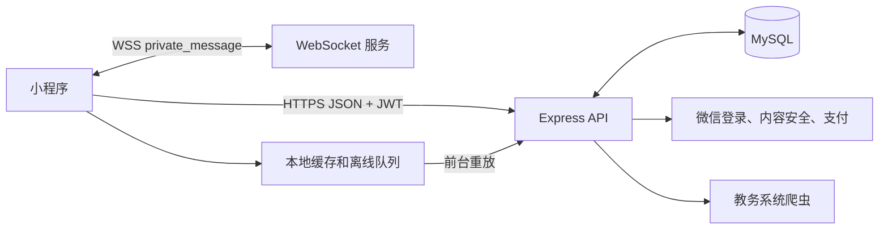

# API 接口契约

## 基础协议

- 基础 URL：`https://<域名>/api/v1`
- 传输：HTTPS，JSON UTF-8。需要身份认证的请求发送 `Authorization: Bearer <JWT>`。
- 所有响应使用 `{ "code": 数字, "message": 字符串, "data": 对象|null, "requestId": 字符串 }` 格式。
- 客户端发送 `X-Request-Id` 用于链路追踪。`X-Idempotency-Key` 支持个人资料和课表配置写入的幂等性，在单个服务进程上有效期为 10 分钟。
- `GET` 请求最多重试两次，针对网络错误、502、503 或 504 错误，重试间隔分别为 300 毫秒和 600 毫秒。业务写入默认不自动重试。个人资料和课表设置会合并到离线队列中，在小程序回到前台时重放。

## 接口清单

| 模块 | 端点 | 客户端调用方 | 用途 |
| --- | --- | --- | --- |
| 用户 | `POST /user/phone-login` | login | 微信手机号登录 |
| 用户 | `GET/PUT /user/info`、`POST /user/verify` | settings、auth | 账户数据与认证 |
| 用户 | `GET /user/profile/:id`、`GET /user/profile/:id/posts` | profile 页面 | 公开个人资料 |
| 用户 | `POST /user/content-check`、`POST /user/upload/image` | 发布、图片工具 | 安全检查和图片上传 |
| 帖子 | `GET /post/list`、`/post/hot`、`/post/:id` | home、detail、search | 读取帖子 |
| 帖子 | `POST /post`、`DELETE /post/:id`、`POST /post/:id/like`、`/favorite` | 发布、卡片 | 帖子变更 |
| 评论 | `GET /comment/list`、`/top-liked`；`POST /comment`；`PUT/DELETE /comment/:id`；`POST /comment/:id/like` | home、detail | 评论生命周期 |
| 分享 | `POST /share`、`GET/DELETE /share/:id` | 分享页面 | 转发生命周期 |
| 消息 | `POST /message/send`；`GET /message/history`、`/conversations`、`/unread-count`；`PUT /message/read`、`/status` | messageStore、chat | 持久化私信 |
| WebSocket | `wss://<域名>/ws?token=<JWT>` | messageStore | 推送 `private_message` 和心跳 |
| 课表 | `GET /schedule/list`、`/config`；`POST /add`、`/replace`、`/clear`、`/ocr`、`/sync`、`/sync/captcha`；`PUT /config` | 课表模块、设置同步 | 课程与跨设备配置 |
| 跑腿 | `GET /errand/list`；`POST /errand`；`POST /errand/:id/accept`、`/finish` | 跑腿模块 | 跑腿订单生命周期 |
| 维修 | `GET/POST /repair/orders`；`POST /repair/orders/:id/pay`；`POST /repair/payment/notify` | 维修页面、支付回调 | 维修预约与支付状态 |
| 服务 | `GET /service/list` | service-all | 服务目录 |

## 数据归属与同步

服务端是用户、帖子、评论、对话、课程、跑腿和维修订单的单一数据源。本地存储仅缓存读取模型或排队可合并的设置。支付完全由服务端微信回调最终确认。
