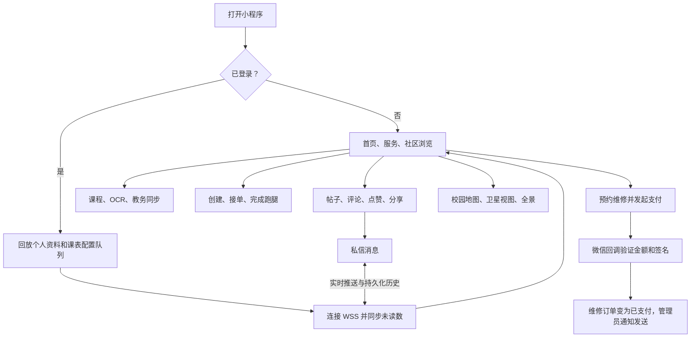

# 系统审计与集成报告

审计日期：2026-08-07。范围：微信小程序、Express API、MySQL 模式、Redis 限流、WebSocket 消息以及服务集成。

## 模块与用户流程

## 已实施的集成修复

1. 小程序统一使用真实 API，开发者工具、体验版和正式版均不会回退到 Mock 数据；发布前必须确认生产 API、数据库和微信合法域名配置可用。
2. 统一客户端/服务端响应信封为 `code`、`message`、`data` 和 `requestId`；请求 ID 会被记录并返回，以便简化问题追踪。
3. 仅对安全的读操作增加有限重试。业务写入默认不重试，以避免重复订单和支付。
4. 将客户端硬编码的 `ws://127.0.0.1:3000/ws` 替换为基于 API 基础 URL 派生的地址，生产环境为 `wss://<域名>/ws`。
5. 为可合并的个人资料和课表配置变更增加离线回放。待回放数据在启动、登录和回到前台时自动重放。
6. 为单个 API 进程上的个人资料和课表写入增加 10 分钟幂等回放。
7. 增加请求安全的内容审核 Token 缓存，以及内容安全不可用时的生产环境安全关闭行为。
8. 通过数据库迁移为信息流、对话、课表、跑腿和维修模块增加复合索引。

## 需要部署时处理的问题

| 优先级 | 问题 | 所需操作 |
| --- | --- | --- |
| P0 | 现有开发密钥不得用于生产环境。 | 轮换所有已暴露的值，将生产密钥存储在部署密钥管理器中，并设置强密码 `JWT_SECRET`。 |
| P0 | 支付和管理员通知需要真实的微信商户密钥、回调域名、模板 ID 和管理员 OpenID。 | 在启用支付前完成 `server/.env` 中的配置。 |
| P1 | 幂等缓存为进程级。 | 在运行多个 API 进程或容器之前将其迁移到 Redis。 |
| P1 | 图片 URL 由本地磁盘提供。 | 将上传迁移到对象存储，使用私有上传凭证、按需签名读取、病毒扫描和生命周期策略。 |
| P1 | 多个外部 H5 服务和 720 全景需要在小程序业务域名中添加白名单。 | 在微信小程序控制台添加所有生产 HTTPS 主机。 |
| P2 | 课程 OCR 回退在无实际 OCR 结果时返回演示课程。 | 接入真实 OCR 输出，并标记低置信度的解析结果供人工审核。 |

## 性能与兼容性验收

当前本地机器没有可访问的 MySQL 或 Redis 服务，因此数据库查询延迟、API 负载、真机渲染、Wi-Fi/4G/弱网行为和支付回调尚未测量。以下内容应视为上线前的验证门槛，而非已完成证据。

| 目标 | 验证方式 |
| --- | --- |
| 首屏可用 ≤ 2 秒 | 微信开发者工具性能面板 + 两台真机，冷启动和热启动，各 20 次，报告 P50/P95。 |
| 交互反馈 ≤ 300 毫秒 | 记录帖子点赞、路由切换、地图校区切换和提交操作的点击，测量首次视觉响应。 |
| API P95 ≤ 500 毫秒 | 针对类生产环境 MySQL 数据运行认证后的 `GET /post/list`、`GET /message/conversations` 和课表读取，启用慢查询日志。 |
| 弱网韧性 | 开发者工具自定义网络配置：300 毫秒延迟、10% 丢包、400 kbps；验证 GET 重试、无重复写入和排队设置回放。 |
| 设备兼容性 | Android 10/12/14 和 iOS 15/16/17，小屏 320px 宽度到大屏 iPhone/Android；验证地图叠加层、键盘、安全区域和长文本。 |

## 上线阻断点与恢复

在 P0 问题关闭之前，不得上线支付、手机号修改或任何处理真实用户数据的功能。启用 MySQL 慢查询日志（阈值 500 毫秒），对 API 5xx、WebSocket 重连失败、回调签名失败和队列回放失败设置告警。使用 `docs/operations.md` 中的备份和恢复流程，每季度执行一次恢复演练。
