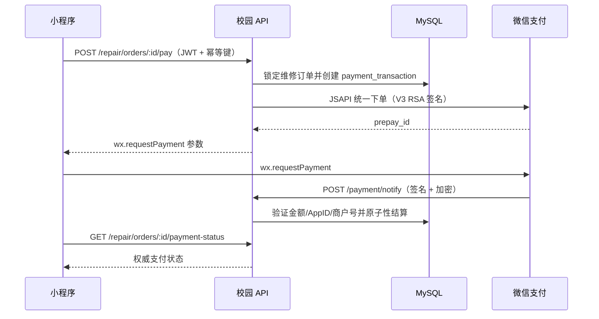

# 微信支付 V3 集成

## 支付流程

`repair_order.status` 仅在收到已验证的微信通知或已验证的主动查询后，才从 `unpaid` 变为 `paid`。客户端回调永远不会被用作结算信号。

## API

| 端点 | 认证方式 | 用途 |
| --- | --- | --- |
| `POST /repair/orders/:id/pay` | 用户 JWT + `X-Idempotency-Key` | 创建/复用支付交易并返回 `wx.requestPayment` 参数。 |
| `GET /repair/orders/:id/payment-status` | 用户 JWT | 结算待处理时查询微信，然后返回本地权威状态。 |
| `POST /payment/notify` | 微信 RSA 签名 | 支付通知。在商户平台配置此 URL。 |
| `POST /payment/refund/notify` | 微信 RSA 签名 | 退款通知 URL。 |
| `GET /payment/transactions` | 操作员/超级管理员 | 分页支付记录管理查询。 |
| `POST /payment/transactions/:id/refunds` | 操作员/超级管理员 | 创建全额或部分退款：`{ "amount": 1.00, "reason": "..." }`。 |
| `GET /payment/refunds/:refundId` | 操作员/超级管理员 | 从微信支付查询退款状态。 |

## 生产环境必要配置

以下值应设置为部署密钥，切勿提交到源码管理：`WX_APPID`、`WX_MCH_ID`、`WX_SERIAL_NO`、`WX_PRIVATE_KEY`（或挂载的 `apiclient_key.pem`）、`WX_APIV3_KEY`、`WX_PAY_NOTIFY_URL`，以及通过 `WX_PLATFORM_PUBLIC_KEY` 或 `WX_PLATFORM_PUBLIC_KEY_PATH` 配置的微信支付平台公钥。当证书文件挂载在其他位置时，设置 `WX_PAY_CERT_DIR`。

通知 URL 必须是已在微信支付中注册的 HTTPS 公网地址。如果操作规程要求，在商户平台配置单独的退款通知 URL；本实现同时接受两种通知，并在解密负载前验证其平台签名。

## 运维检查清单

1. 在微信商户平台完成商户实名认证、绑定小程序 AppID 并开通 JSAPI 支付。
2. 创建 API 证书，将其私钥部署为受保护的密钥，并记录其证书序列号。
3. 配置 APIv3 密钥，下载/轮换微信支付平台公钥。轮换时，原子性地更新 `WX_PLATFORM_PUBLIC_KEY_PATH`。
4. 在上线前执行数据库迁移。确认唯一的支付-订单索引已存在。
5. 在商户沙箱或测试商户中，运行以下测试：支付成功、取消支付、延迟回调、重复回调、支付关闭、全额退款、部分退款和重复退款。
6. 对两个通知端点的 5xx 响应、`payment_transaction.last_error` 以及超过 30 分钟仍处于 `PREPAY` 状态的支付设置告警。按计划通过主动状态 API 对账未完成的交易。

通过部署调度器至少每 10 分钟运行一次 `npm run reconcile:payments`。该脚本仅检查超过 `PAYMENT_RECONCILE_MINUTES`（默认 30 分钟）的支付行，结算已验证的成功交易，并关闭已确认的过期交易。将非零退出码和 JSON 摘要发送到生产告警系统。

## 安全规则

- 服务端从锁定的业务订单中派生所有应付金额，忽略客户端提交的金额。
- V3 请求使用 `WECHATPAY2-SHA256-RSA2048` 签名。入站回调经新鲜度检查、签名验证后，再进行 AES-256-GCM 解密。
- 结算时在数据库行锁下验证 AppID、商户号、商户订单号和金额。重复回调具有幂等性。
- 退款以事务方式预留请求金额，确保并发部分退款不会超过已支付金额。
- 证书和密钥仅存储在密钥管理器或具有受限权限的文件系统挂载中。不要记录回调密文、私钥、完整支付参数、手机号或交易负载。