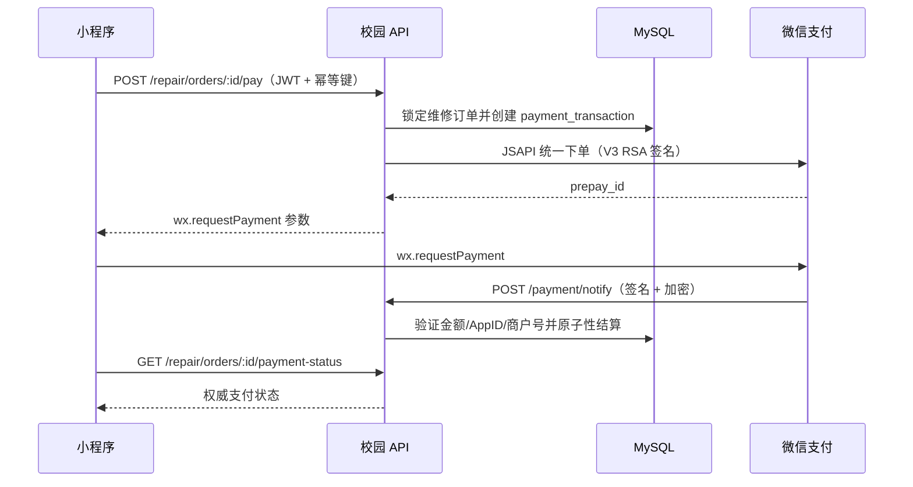

# 订单跑腿与支付钱包

## 概述

校园论坛小程序的资金链路为：**跑腿订单 → 微信支付 → 钱包余额 → 提现打款**。

1. 用户发布跑腿订单并通过微信支付 V3（JSAPI）完成付款，订单状态由 `unpaid` 转为 `paid`。
2. 跑腿完成后，系统生成钱包收益并计入余额（仅已支付的跑腿完成时入账）。
3. 用户发起提现，系统冻结请求金额直至驳回或微信完成转账。
4. 管理后台有 `payment.manage` 权限的管理员审核通过后，调用微信「商家转账」接口从商户**运营账户**出款到用户微信零钱。
5. 微信转账回调标记提现单据为已支付 / 失败，失败单据回到 `PENDING` 可原单号重试。

---

## 原始文档清单

| 原文件名 | 日期 | 一句话要点 |
| --- | --- | --- |
| 修复说明_2026-09-10_跑腿订单状态角标永久隐藏.md | 2026-09-10 | 状态角标"永久隐藏"在用户点开 500+ 终态订单后失效，根因是 `markFinalRead` 的 500 条截断驱逐了最早已读 id。 |
| 修复说明_2026-09-11_跑腿时间字段.md | 2026-09-11 | 订单卡片重复展示「期望完成时间」，且 `appointment_time` / `accept_deadline` 未下发/未取值，统一为期望时间 + 截止时间两字段。 |
| 功能说明_2026-09-11_订单标签未读红点.md | 2026-09-11 | 互助大厅顶部「我接的单 / 我发布的 / 已完成的」标签加未读小红点，与数字角标同源联动。 |
| 修复说明_2026-09-12_提现失败运营账户余额不足.md | 2026-09-12 | 提现打款 403 `NOT_ENOUGH`：基本账户资金不能用于出款，须充运营账户；并改进错误翻译与 422 结构化返回。 |
| wallet-withdrawal.md | （无日期） | 提现部署说明：收益仅在已支付跑腿完成时入账，提现冻结余额，转账回调落库，需 `WX_TRANSFER_NOTIFY_URL`。 |
| wechat-pay.md | （无日期） | 微信支付 V3 集成：JSAPI 下单 / 回调签名校验 / 退款 / 主动对账，及全部支付相关环境变量。 |

---

## 跑腿订单状态机与状态角标

### 状态机

订单状态分组（数字角标与标签红点依据）与内部流转：

| 展示分组 | 说明 |
| --- | --- |
| 待支付 | 已发布未付款 |
| 待接单 | 已支付无人接 |
| 待完成 | 已接单未完成 |
| 已完成 | 终态 |
| 已取消 | 终态（含「退款中」视为已取消终态） |

已读回归测试覆盖的内部流转：`待支付 → 已支付`、`待接单 → 已接单`、`待完成 → 已完成`；其中 `已完成` / `已取消` 为终态，点开详情一次即永久已读。未知状态不入任何分组。

### 状态角标"永久隐藏"问题

#### 现象

`pages/errand/index.js` 在「我接的单 / 我发布的」标签下的状态角标（待支付 / 待接单 / 待完成 / 已完成 / 已取消）虽已实现"点开详情一次后永久隐藏"，但用户长期使用后已读角标会**重新出现**，与承诺冲突。

#### 根因

`markFinalRead`（`pages/errand/index.js`）有一段"防膨胀"截断：

```js
this._readFinalIds.add(id);
const arr = Array.from(this._readFinalIds);
// 上限 500 条，防本地存储无限膨胀
if (arr.length > 500) this._readFinalIds = new Set(arr.slice(-500));
wx.setStorageSync(READ_FINAL_KEY, Array.from(this._readFinalIds));
```

- `arr.slice(-500)` 保留**最新插入**的 id，**丢弃最早**插入的 id。
- 用户累计点开超过 500 条已完成 / 已取消订单后，最早被点开的那批订单从 `_readFinalIds` 与本地存储蒸发，冷启动重新加载时 `computeCounts` 视其为"未读" → 角标重新出现，违反"永久隐藏"硬约束。

旁路：`wx.setStorageSync` 在部分环境（开发者工具本地存储被禁 / 配额超限）会**静默抛错**，且函数无 try/catch，加剧"内存更新了但磁盘没更新"的不一致。

> 说明：已读 id 的存储 key 早已按用户隔离为 `errand_read_final_order_ids:<userId>`（2026-09-11 时间字段文档的回归修复已同步测试用例，此前裸 key 断言挂掉 1 项）。

#### 处理方案

| 位置 | 问题 | 修复 |
| --- | --- | --- |
| `pages/errand/index.js` `markFinalRead` | `arr.slice(-500)` 驱逐最早已读 id，"永久隐藏"在用户浏览 500+ 终态订单后失效 | **取消 500 上限截断**：单 id ≈ 10 字节，微信单 key 上限 1MB，可容纳约 10 万条 id，远超用户终态订单累计量 |
| `pages/errand/index.js` `markFinalRead` | `wx.setStorageSync` 抛错时内存已更新但冷启动丢失 | 用 `try / catch` 包裹 `setStorageSync`，失败时 `console.warn` 不阻断；内存已更新保证本次会话内角标立刻隐藏 |
| `pages/errand/index.js` `READ_FINAL_KEY` 上方注释 | 与"防膨胀截断"绑定的旧注释已过时 | 改为说明「不做截断 + 微信存储上限保护」的设计依据 |
| `server/tests/errand-status-badge.test.js` | 缺五大场景回归、缺 cap 驱逐的反向断言 | 新增 24 条断言（含反向验证） |

#### 涉及文件

- `pages/errand/index.js`、`server/tests/errand-status-badge.test.js`

#### 验证

```
$ node server/tests/errand-status-badge.test.js
24 tests passed.
```

覆盖：① 待支付 → 已支付 ② 待接单 → 已接单 ③ 待完成 → 已完成 ④ 已完成点开一次永久隐藏（含重启跨实例）⑤ 已取消点开一次永久隐藏（含重启跨实例）⑥ 退款中视为已取消终态 ⑦ 800+ 已读 id 时不截断、最早已读订单角标仍为 0 ⑧ 未知状态不入任何分组 ⑨ 存储中已读已完成订单不计入。

反向验证（把 `markFinalRead` 改回 `if (arr.length > 500)` 重跑）：

```
FAILED: 不去截断已读 id：用户浏览 800+ 已完成订单后角标仍永久隐藏
500 !== 801
```

确认测试非"假绿"。

#### 结论

取消截断 + try/catch 后，角标真正"永久隐藏"。微信单 key 1MB / 10 字节每 id 可容纳约 10 万条已读 id，按现状无需清理逻辑；极端触顶时写入失败被 `console.warn` 捕获，最差退化为"重启后重新出现"，不再有"看过但角标还在"的不一致。

---

## 订单时间字段口径

### 现象

订单列表卡片出现两个「期望完成时间」标签——第一行是发单人用公开描述快捷标签插入的空文案「期望完成时间：」，第二行才是卡片自身的期望时间行；截止接单时间从未在卡片展示；接单大厅 / 订单管理页的期望时间取值链路缺 `appointment_time`（服务端 snake_case），实际恒显示「越快越好」。

### 根因

- 发布页把「期望完成时间」快捷标签插入 remark，与独立期望完成时间字段构成重复标签，且被标为必填。
- 接单大厅列表 SELECT 未下发 `accept_deadline`，前端无数据可展示截止时间。
- 前端 `expectText` 兜底链缺 `appointment_time`，服务端数据恒落「越快越好」；`remark` 历史前缀「期望完成时间：」原样展示。

### 处理方案

| 位置 | 问题 | 修复 |
| --- | --- | --- |
| `pages/errand-publish/index.wxml` | 快捷标签「期望完成时间」插入 remark 造成重复；期望时间被标必填 | 移除该快捷标签（保留「送达地点」）；期望时间改选填，提示「未填写将显示越快越好」 |
| `pages/errand-publish/index.js` | `onSubmit` 强制校验期望完成时间非空 | 移除必填校验，空值原样提交由服务端存 NULL |
| `server/controllers/errandController.js` `create` | `pickupTimeType === '预约'` 且期望时间为空时报「请填写期望完成时间」 | 改选填：空 → 存 NULL；非空仅校验长度 ≤ 64 |
| `server/controllers/errandController.js` `list` | 接单大厅 SELECT 未下发 `accept_deadline` | SELECT 增加 `e.accept_deadline` |
| `pages/errand/index.js` | `expectText` 兜底缺 `appointment_time`；无截止时间取值；remark 前缀原样展示 | 兜底链补 `appointment_time`；新增 `formatDeadlineText`（UTC ISO 串/裸串 → 本地「M月D日 HH:mm」）与 `cleanDescText`（清理开头「期望完成时间：/期望时间：」前缀，清空回退标题）；`normalizeOrder` 输出 `deadlineText` |
| `pages/errand/index.wxml` | 单行「期望完成时间：」 | 改「期望时间：{{expectText}}」+「截止时间：{{deadlineText}}」（未设置不显示） |
| `pages/errand-order/index.js` / `index.wxml` | 订单管理页缺取值 | 同接单大厅：期望/截止两字段独立展示 + 描述前缀清理 |
| `pages/errand-detail/index.wxml` | 详情页计算 `appointmentText` 从未展示；截止行标签「截止接单时间」 | 需求信息卡新增「期望时间」行（未填显示「越快越好」）；标签统一「截止时间」 |

### 字段语义（修复后）

| 字段 | 来源 | 展示 |
| --- | --- | --- |
| 期望时间 | `errand_order.appointment_time`（发布页选填自由文本） | 未填写 → 「越快越好」 |
| 截止时间 | `errand_order.accept_deadline`（发布页可选设置的接单截止） | 未设置 → 该行不显示；设置 → 「M月D日 HH:mm」（卡片）/ 完整时分秒（详情页） |

### 涉及文件·接口·环境变量

- `pages/errand-publish/*`、`server/controllers/errandController.js`、`pages/errand/*`、`pages/errand-order/*`、`pages/errand-detail/index.wxml`
- 数据库字段：`errand_order.appointment_time`、`errand_order.accept_deadline`

### 验证

- 新增 `server/tests/errand-time-fields.test.js`（13 项）：vm 加载接单大厅与订单管理页真实 `normalizeOrder`，覆盖期望时间有/无、截止时间格式化（时区无关断言）、描述前缀清理；假 pool 校验大厅列表 SQL 下发 `accept_deadline`、create 空/非空期望时间入库参数。反向验证：回退 `pages/errand/index.js` 后测试以 exit 1 失败。
- 全量：`time-fields` 13 / `status-badge` 24 / `local-imports` 2 / `json-column-param` 5 全部通过。

### 部署提醒

本次改动含服务端 `server/controllers/errandController.js`，须用 `deploy_full.py` 全量清单部署；仅前端改动用 `deploy.py` 会导致线上接口未更新。

### 结论

期望时间 / 截止时间两字段独立、口径统一，历史重复标签与「越快越好」硬编码问题消除。

---

## 订单标签未读红点

### 现象

需求：订单页面顶部「我接的单」「我发布的」「已完成的」右上角显示未读小红点，与状态筛选行数字角标联动——数字因订单被读取而消失时红点同步熄灭，再次出现未读订单时重新亮起。

### 处理方案

| 位置 | 改动 |
| --- | --- |
| `pages/errand/index.js` | data 新增 `tabDots: { accepted, published, done }`；新增 `refreshTabDots()`：与数字角标同一数据源（`_mineCache` + `_localStatus` 乐观态 + `_readFinalIds` 已读集合）判定各标签是否存在未读订单；缓存未加载时全部熄灭不误报 |
| 联动挂点 | `refreshBadgesNow()`（markFinalRead / 支付接单后的即时刷新入口）开头先刷红点；`renderMine()` 渲染后刷新；`onShow()` 在接单大厅（tab 0，`renderCachedTab` 不触发）单独刷新 |
| `pages/errand/index.wxml` | 标签文本包 `.list-tab-text-wrap`，红点节点按 `index === 1/2/3` 分别绑定 `tabDots.accepted/published/done` |
| `pages/errand/index.wxss` | `.list-tab-text-wrap { position: relative }` 作定位基准；`.tab-dot` 14rpx 圆点绝对定位右上角，配色 `#f5484d` 与数字角标一致 |

### 判定口径（与数字角标完全一致）

- 我接的单 / 我发布的：来源缓存中存在任一未读订单（任意状态组；已读的已完成 / 已取消不计）。
- 已完成的：任一来源存在未读的已完成订单。
- 未读 = 未出现在 `_readFinalIds`（点开详情一次永久已读，按账号隔离持久化于 `errand_read_final_order_ids:<userId>`）。

### 涉及文件

- `pages/errand/index.js`、`pages/errand/index.wxml`、`pages/errand/index.wxss`

### 验证

- 新增 `server/tests/errand-tab-dots.test.js`（10 项）：vm 加载真实页面，覆盖缓存未加载全熄、各标签亮/熄、乐观状态实时反映、真实 `markFinalRead` 链路熄灭并持久化、新未读订单重新亮起、WXML/WXSS 静态断言。反向验证（回退源码 exit 1）。
- 全量：`tab-dots` 10 / `status-badge` 24 / `time-fields` 13 / `local-imports` 2 全部通过。
- vm 测试注意：沙箱对象跨 realm，`deepStrictEqual` 直接比 `page.data.tabDots` 会假失败，需 `JSON.parse(JSON.stringify(...))` 降级比较。

### 结论

红点与数字角标同源联动，未读判定口径一致，无重复状态。

---

## 微信支付 V3 接入

### 接入概览与支付流程



`repair_order.status` 仅在收到已验证的微信通知或已验证的主动查询后，才从 `unpaid` 变为 `paid`。客户端回调永不作为结算信号。

### 接口清单

| 端点 | 认证方式 | 用途 |
| --- | --- | --- |
| `POST /repair/orders/:id/pay` | 用户 JWT + `X-Idempotency-Key` | 创建/复用支付交易并返回 `wx.requestPayment` 参数 |
| `GET /repair/orders/:id/payment-status` | 用户 JWT | 结算待处理时查询微信，返回本地权威状态 |
| `POST /payment/notify` | 微信 RSA 签名 | 支付通知，在商户平台配置此 URL |
| `POST /payment/refund/notify` | 微信 RSA 签名 | 退款通知 URL |
| `GET /payment/transactions` | 操作员/超级管理员 | 分页支付记录管理查询 |
| `POST /payment/transactions/:id/refunds` | 操作员/超级管理员 | 创建全额或部分退款：`{ "amount": 1.00, "reason": "..." }` |
| `GET /payment/refunds/:refundId` | 操作员/超级管理员 | 从微信支付查询退款状态 |

### 安全规则

- 服务端从锁定的业务订单派生所有应付金额，忽略客户端提交金额。
- V3 请求使用 `WECHATPAY2-SHA256-RSA2048` 签名。入站回调经新鲜度检查、签名验证后再做 AES-256-GCM 解密。
- 结算时在数据库行锁下验证 AppID、商户号、商户订单号和金额；重复回调幂等。
- 退款以事务预留请求金额，确保并发部分退款不超已付金额。
- 证书与密钥仅存于密钥管理器或受限权限的文件系统挂载；**不记录**回调密文、私钥、完整支付参数、手机号或交易负载。

### 运维检查清单

1. 商户平台完成实名认证、绑定小程序 AppID、开通 JSAPI 支付。
2. 创建 API 证书，私钥部署为受保护密钥，记录证书序列号。
3. 配置 APIv3 密钥，下载/轮换微信支付平台公钥（轮换时原子更新 `WX_PLATFORM_PUBLIC_KEY_PATH`）。
4. 上线前执行数据库迁移，确认唯一的支付-订单索引已存在。
5. 沙箱/测试商户运行：支付成功、取消支付、延迟回调、重复回调、支付关闭、全额退款、部分退款、重复退款。
6. 对两个通知端点 5xx、`payment_transaction.last_error`、超过 30 分钟仍 `PREPAY` 的支付设告警；按计划通过主动状态 API 对账未完成交易。
7. 部署调度器至少每 10 分钟运行 `npm run reconcile:payments`：仅检查超过 `PAYMENT_RECONCILE_MINUTES`（默认 30 分钟）的支付行，结算已验证成功交易、关闭已确认过期交易；将非零退出码与 JSON 摘要发生产告警。

### 环境变量（含提现，合并去重）

| 环境变量 | 用途 | 备注 |
| --- | --- | --- |
| `WX_APPID` | 小程序 AppID | 部署密钥，勿入库 |
| `WX_MCH_ID` | 微信支付商户号 | 部署密钥 |
| `WX_SERIAL_NO` | API 证书序列号 | 部署密钥 |
| `WX_PRIVATE_KEY` | 商户 API 私钥 | 或挂载 `apiclient_key.pem`；优先文件挂载 |
| `WX_APIV3_KEY` | APIv3 密钥 | 部署密钥 |
| `WX_PAY_NOTIFY_URL` | 支付通知 URL（`POST /payment/notify`） | 须为微信支付已注册的 HTTPS 公网地址 |
| `WX_TRANSFER_NOTIFY_URL` | 提现转账回调 URL（`POST /api/v1/wallet/transfer/notify`） | 公网 HTTPS |
| `WX_PLATFORM_PUBLIC_KEY` | 微信支付平台公钥（直接值） | 与 `_PATH` 二选一 |
| `WX_PLATFORM_PUBLIC_KEY_PATH` | 微信支付平台公钥（文件路径） | 轮换时原子更新 |
| `WX_PAY_CERT_DIR` | 证书目录 | 证书挂载在非默认位置时设置 |
| `PAYMENT_RECONCILE_MINUTES` | 支付对账阈值 | 默认 30 分钟 |

### 验证

- 沙箱/测试商户跑通支付成功、取消、延迟回调、重复回调、关闭、全额/部分/重复退款。
- 两个通知端点 5xx、`last_error`、超 30 分钟 `PREPAY` 的告警与定时对账脚本就绪。

### 结论

V3 接入以服务端派生金额 + 行锁校验 + 回调签名/解密为核心，幂等安全；环境变量需全量以部署密钥注入，回调 URL 必须为已注册公网 HTTPS。

---

## 钱包余额与收益入账规则

### 现象 / 要点

钱包收益（earnings）来源与冻结规则：

- **收益仅在已支付的跑腿订单完成时创建入账**（wallet-withdrawal 文档：`Wallet earnings are created only when a paid errand is completed`）。
- 提现请求（withdrawal request）会**冻结请求金额**，直至该请求被驳回或微信完成转账才解冻/扣减。

### 涉及文件·接口

- 钱包相关：`server/controllers/walletController.js`
- 转账回调：`POST /api/v1/wallet/transfer/notify`（`WX_TRANSFER_NOTIFY_URL`）
- 权限：提现审核需管理员具备 `payment.manage` 权限

### 结论

入账与冻结口径清晰：先完成且已支付才产生收益；提现冻结避免重复出款。钱包入口当前是否应开放见文末遗留问题。

---

## 提现流程与运营账户余额不足的处理

### 现象

管理后台点「提现审核 → 通过」时页面弹出：

```
WeChat Pay /v3/fund-app/mch-transfer/transfer-bills failed (HTTP 403)
NOT_ENOUGH 商户运营账户资金不足，充值后可以原单号发起重试，请勿更换商户单号
```

调试控制台同时出现 `POST https://payun01.cn/api/v1/admin/withdrawals/1/review 502`。

管理员困惑点：微信支付商户平台显示「基本账户 2.00 元」，为何提不了？

### 根因（非程序 bug，是微信资金规则）

微信支付商户号资金分在两个互不通用的账户：

| 账户 | 资金来源 | 用途 |
| --- | --- | --- |
| 基本账户 | 用户付款、交易收款结算 | **只能收款**，按结算周期打到商户结算银行卡 |
| 运营账户 | **只能用银行卡充值**（扫码/网银/转账） | 商家转账、现金红包、代金券等**所有对外出款** |

关键规则（微信官方）：

1. **「商家转账」（本项目提现打款接口）只能从「运营账户」出款。**（参考：微信支付商户文档「充值_商家转账」——运营业务均需通过运营账户出资，请充值至运营账户。）
2. **基本账户与运营账户资金不能互转。** 微信自 2022 年底取消「基本账户 → 运营账户」划转，运营账户资金须用银行卡充值、专款专用。

故截图里基本账户 2.00 元是用户付款结算款，只能结算到商户银行卡，不能用于打款；真正出款的运营账户为 0.00 元 —— 即 `NOT_ENOUGH` 由来。

> 注意：`NOT_ENOUGH` 虽 HTTP 状态 403，但**不是权限问题**，微信仅用 403 表示"该转账被拒绝"，真正原因以响应体 `code` / `message` 为准。

### 处理方案

#### 1. 运营操作（5 分钟）

1. 登录微信支付商户平台 <https://pay.wechatpay.cn>；
2. 进入 **交易中心 → 充值/转入**；
3. **入款账户选「运营账户」**（最关键，选错成基本账户等于没充）；
4. 选「扫码充值」或「网银充值」，用**银行卡**充入所需金额（银行转账方式需先在 **产品中心 → 资金解决方案 → 转账充值** 开通权限）；
5. 确认运营账户余额 ≥ 待打款金额（建议多留几元避免尾差）；
6. 回管理后台「审核 → 提现审核」，对该单据点 **「重试打款」**。

> **必须用原商户单号重试**（微信明确要求）。本项目重试复用首次申请生成的 `out_batch_no`，直接点「重试打款」即可，**不要驳回让用户重新申请**（驳回重申请会消耗用户每日提现次数，上限 5 次/日）。

#### 2. 代码侧改进

| 位置 | 改动 |
| --- | --- |
| `server/services/wechatPayV3Service.js` | 新增 `describeTransferError(error)`，把微信原始错误译为三段式 `{ code, message, hint }`：`code` 供前端分支（如 `WITHDRAW_CHANNEL_NOT_ENOUGH`）、`message` 一句话结论、`hint` 可照做指引。覆盖：运营账户余额不足 / 产品未开通 / 403 无权限或 IP 白名单 / 转账场景未开通或报备不符 / openid 不匹配 / 频控 / 微信系统繁忙 / 单据不存在 / 兜底（保留微信原文）。分支顺序：`openid` 判断须排在通用「场景/参数」分支前（否则 openid 不匹配时微信同样返 `PARAM_ERROR`，会误报成商户配置问题） |
| `server/controllers/walletController.js` | 失败时用 `describeTransferError` 翻译，`last_error` 落库为「结论｜处置指引」；返回 **422 + `{ code, hint }`** 结构化数据（原裸 502；请求合法、属商户侧资金问题，不该当网关故障触发前端重试）；失败后单据回 `PENDING` 可原单号重试；`listWithdrawals` 回传 `lastError` |
| `server/middleware/auth.js` | `fail(res, message, code, data)` 增加可选 `data` 参数（默认 `null`，旧契约不变） |
| `pkg-admin/admin/index.js` | 审核失败改 `wx.showModal` 弹**完整原因 + 处置指引 + 错误码**，不再静默吞异常（原 `catch (e) {}`）；请求加 `silent` 避免 toast 与弹窗重复；`loadWithdrawals` 派生 `lastErrorBrief`（只取「结论」，指引留弹窗） |
| `pkg-admin/admin/index.wxml` | 提现列表展示「上次打款失败：…」，失败过单据多给「重试打款」按钮 |
| `pkg-admin/utils/admin.js` | `post` 与 `reviewWithdrawal` 支持透传 `opts` |

### 涉及文件·接口·环境变量

- 服务：`server/services/wechatPayV3Service.js`、`server/controllers/walletController.js`、`server/middleware/auth.js`
- 后台：`pkg-admin/admin/index.js`、`pkg-admin/admin/index.wxml`、`pkg-admin/utils/admin.js`
- 微信接口：`/v3/fund-app/mch-transfer/transfer-bills`
- 后台接口：`POST /api/v1/admin/withdrawals/:id/review`
- 关键变量：`out_batch_no`（商户单号，重试复用）、错误码 `NOT_ENOUGH` / `WITHDRAW_CHANNEL_NOT_ENOUGH` / `WITHDRAW_CHANNEL_NO_AUTH` / `WITHDRAW_CHANNEL_SCENE` / `PARAM_ERROR`

### 验证

- `node tests/wallet-withdraw-error.test.js` 通过；`npm test` 全量 10 个测试文件全绿；
- 5 个改动 JS 文件 `node --check` 通过；`pkg-admin/admin/index.wxml` 标签配对与表达式合法性检查通过。

### 结论

根因在资金规则而非代码；代码改进让失败可排查（结构化 422 + 中文指引 + 重试入口），不再误报 502。

---

## 管理员审核与转账回调

### 审核流程

- 管理员（需 `payment.manage` 权限）在管理后台「审核 → 提现审核」通过打款，服务端调用微信「商家转账」创建**单用户转账批次**到请求人绑定的微信 `openid`。
- 审核通过即创建转账批次；失败则单据回 `PENDING`，可原 `out_batch_no` 重试。
- 审核失败旧逻辑静默吞异常，新版 `wx.showModal` 弹完整原因 + 处置指引 + 错误码，并提供「重试打款」入口。

### 转账回调

- 微信回调 `POST /api/v1/wallet/transfer/notify`（`WX_TRANSFER_NOTIFY_URL`，公网 HTTPS）。
- 回调标记提现单据为 **已支付（paid）** 或 **失败（failed）**：失败回 `PENDING` 可重试；成功则解冻并扣减冻结的提现金额。

### 涉及文件·接口

- `server/controllers/walletController.js`、`pkg-admin/admin/*`
- 回调：`POST /api/v1/wallet/transfer/notify`
- 审核：`POST /api/v1/admin/withdrawals/:id/review`

### 结论

审核与回调闭环：审核通过 → 调微信出款 → 回调落库终态；失败可原单号重试，不消耗用户重申请次数。

---

## 遗留问题与后续建议

1. **钱包入口当前是否应关闭**：钱包收益仅在已支付跑腿完成时入账，而提现依赖商户**运营账户**余额。若运营账户未充值即开放提现入口，用户提现将必然 `NOT_ENOUGH` 失败。建议在运营账户余额充足前，评估是否对普通用户关闭钱包「提现」入口或置灰，并展示"提现暂不可用"提示，避免产生大量失败单据。
2. **运营账户余额监控**：建议对运营账户余额设告警（低于某阈值时提醒充值），并将"提现前先看运营账户余额"写入运维 SOP（余额不会因用户付款自动增加）。
3. **充值后失败分支**：按弹窗错误码处理——`WITHDRAW_CHANNEL_NO_AUTH` → 开通产品 / 检查 IP 白名单；`WITHDRAW_CHANNEL_SCENE` → 开通并报备转账场景。
4. **重试纪律**：微信要求失败重试保持原商户单号（本项目已满足 `out_batch_no` 复用），严禁用「驳回 + 用户重新申请」绕过，否则消耗用户每日 5 次提现额度。
5. **文档时效**：wallet-withdrawal.md 与 wechat-pay.md 无日期，其环境变量与接口描述以本文「微信支付 V3 接入」「环境变量表」为准；若后续微信变更平台公钥/证书机制，需同步更新 `WX_PLATFORM_PUBLIC_KEY_PATH` 轮换流程。
